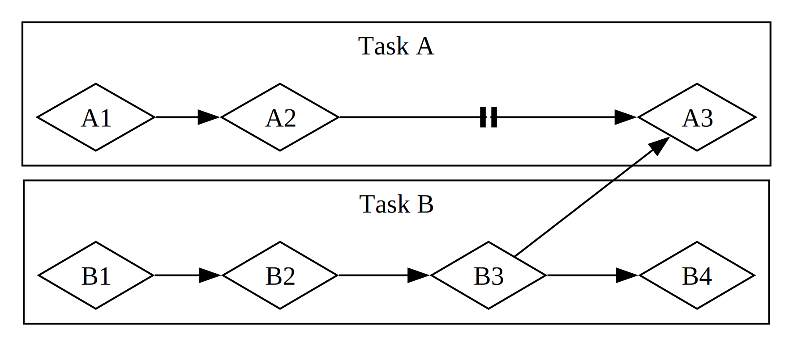

# 私家版Rust入門

The Bookの目次は以下の通りです。20章から構成されており
始めから順に学んでいく形式になっていますが、
初歩的な内容も含め網羅されているためある程度プログラミングの経験があればざっと
読み飛ばしながら進められるため実際に学習しなければならない事柄は
それほど多く無いと思います。

## 目次

- [目次](#目次)
- [1. 事始め](#1-事始め)
  - [とりあえず動かしてみる](#とりあえず動かしてみる)
- [2. 数当てゲームのプログラミング](#2-数当てゲームのプログラミング)
  - [変数の束縛](#変数の束縛)
  - [コマンドライン引数による入力](#コマンドライン引数による入力)
  - [数値比較と判定](#数値比較と判定)
- [3. 一般的なプログラミングの概念](#3-一般的なプログラミングの概念)
  - [3.1 変数と可変性](#31-変数と可変性)
  - [3.2 データ型](#32-データ型)
  - [3.3 関数](#33-関数)
  - [3.4 コメント](#34-コメント)
  - [3.5 制御フロー](#35-制御フロー)
- [4. 所有権を理解する](#4-所有権を理解する)
  - [4.1 所有権とは](#41-所有権とは)
  - [4.2 参照と借用](#42-参照と借用)
  - [4.3 スライス型](#43-スライス型)
- [5. 構造体を使用して関係のあるデータを構造化する](#5-構造体を使用して関係のあるデータを構造化する)
  - [5.1 構造体を定義し、インスタンス化する](#51-構造体を定義しインスタンス化する)
  - [5.2 構造体を使ったプログラム例](#52-構造体を使ったプログラム例)
  - [5.3 メソッド記法](#53-メソッド記法)
- [6. Enumとパターンマッチング](#6-enumとパターンマッチング)
  - [6.1 Enumを定義する](#61-enumを定義する)
  - [6.2 match制御フロー演算子](#62-match制御フロー演算子)
  - [6.3 if letで簡潔な制御フロー](#63-if-letで簡潔な制御フロー)
- [7. 肥大化していくプロジェクトをパッケージ、クレート、モジュールを利用して管理する](#7-肥大化していくプロジェクトをパッケージクレートモジュールを利用して管理する)
  - [7.1 パッケージとクレート](#71-パッケージとクレート)
  - [7.2 モジュールを定義して、スコープとプライバシーを制御する](#72-モジュールを定義してスコープとプライバシーを制御する)
  - [7.3 モジュールツリーの要素を示すためのパス](#73-モジュールツリーの要素を示すためのパス)
  - [7.4 useキーワードでパスをスコープに持ち込む](#74-useキーワードでパスをスコープに持ち込む)
  - [7.5 モジュールを複数のファイルに分割する](#75-モジュールを複数のファイルに分割する)
- [8. 一般的なコレクション](#8-一般的なコレクション)
  - [8.1 ベクタで値のリストを保持する](#81-ベクタで値のリストを保持する)
  - [8.2 文字列でUTF-8でエンコードされたテキストを保持する](#82-文字列でutf-8でエンコードされたテキストを保持する)
  - [8.3 キーとそれに紐づいた値をハッシュマップに格納する](#83-キーとそれに紐づいた値をハッシュマップに格納する)
- [9. エラー処理](#9-エラー処理)
  - [9.1 panic!で回復不能なエラー](#91-panicで回復不能なエラー)
  - [9.2 Resultで回復可能なエラー](#92-resultで回復可能なエラー)
  - [9.3 panic!すべきかするまいか](#93-panicすべきかするまいか)
- [10. ジェネリック型、トレイト、ライフタイム](#10-ジェネリック型トレイトライフタイム)
  - [10.1 ジェネリックなデータ型](#101-ジェネリックなデータ型)
  - [10.2 トレイト:共通の振る舞いを定義する](#102-トレイト共通の振る舞いを定義する)
  - [10.3 ライフタイムで参照を検証する](#103-ライフタイムで参照を検証する)
- [11. 自動テストを書く](#11-自動テストを書く)
  - [11.1 テストの記述法](#111-テストの記述法)
  - [11.2 テストの実行のされ方を制御する](#112-テストの実行のされ方を制御する)
  - [11.3 テストの体系化](#113-テストの体系化)
- [12. 入出力プロジェクト：コマンドラインプログラムを構築する](#12-入出力プロジェクトコマンドラインプログラムを構築する)
  - [12.1 コマンドライン引数を受け付ける](#121-コマンドライン引数を受け付ける)
  - [12.2 ファイルを読み込む](#122-ファイルを読み込む)
  - [12.3 リファクタリングしてモジュール性とエラー処理を向上させる](#123-リファクタリングしてモジュール性とエラー処理を向上させる)
  - [12.4 テスト駆動開発でライブラリの機能を開発する](#124-テスト駆動開発でライブラリの機能を開発する)
  - [12.5 環境変数を取り扱う](#125-環境変数を取り扱う)
  - [12.6 標準出力ではなく標準エラーにエラーメッセージを書き込む](#126-標準出力ではなく標準エラーにエラーメッセージを書き込む)
- [13. 関数型言語の機能：イテレータとクロージャ](#13-関数型言語の機能イテレータとクロージャ)
  - [13.1 クロージャ: 環境をキャプチャできる匿名関数](#131-クロージャ-環境をキャプチャできる匿名関数)
- [14. CargoとCrates.ioについてより詳しく](#14-cargoとcratesioについてより詳しく)
  - [14.1 リリースプロファイルでビルドをカスタマイズする](#141-リリースプロファイルでビルドをカスタマイズする)
  - [14.2 Crates.ioにクレートを公開する](#142-cratesioにクレートを公開する)
  - [14.3 Cargoのワークスペース](#143-cargoのワークスペース)
- [15. スマートポインタ](#15-スマートポインタ)
  - [15.1 ヒープのデータを指すBoxを使用する](#151-ヒープのデータを指すboxを使用する)
  - [15.2 Derefトレイトでスマートポインタを普通の参照のように扱う](#152-derefトレイトでスマートポインタを普通の参照のように扱う)
  - [15.3 Dropトレイトで片付け時にコードを走らせる](#153-dropトレイトで片付け時にコードを走らせる)
  - [15.4 参照カウント方式のスマートポインタ Rc](#154-参照カウント方式のスマートポインタ-rc)
  - [15.5 RefCellと内部可変性パターン](#155-refcellと内部可変性パターン)
  - [15.6 循環参照はメモリをリークすることもある](#156-循環参照はメモリをリークすることもある)
- [16. 恐れるな！並行性](#16-恐れるな並行性)
  - [16.1 スレッドを用いたコードの同時実行](#161-スレッドを用いたコードの同時実行)
  - [16.2 メッセージ送信によるスレッド間でのデータ送受信](#162-メッセージ送信によるスレッド間でのデータ送受信)
  - [16.3 状態を共有する並行性](#163-状態を共有する並行性)
  - [16.4 SyncトレイトとSendトレイトによる並行性の拡張](#164-syncトレイトとsendトレイトによる並行性の拡張)
- [17. 非同期プログラミングの基本: Async Await Futures Streams](#17-非同期プログラミングの基本-async-await-futures-streams)
  - [17.1 FuturesシンタックスとAsyncシンタックス](#171-futuresシンタックスとasyncシンタックス)
  - [17.2  asyncによる並行処理](#172--asyncによる並行処理)
  - [17.3 任意の数のFutureを使う](#173-任意の数のfutureを使う)
  - [17.4](#174)
- [18. Rustのオブジェクト指向プログラミング機能](#18-rustのオブジェクト指向プログラミング機能)
  - [18.1 オブジェクト指向言語の特徴](#181-オブジェクト指向言語の特徴)
  - [18.2 異なる型の値を許容するためのトレイトオブジェクト](#182-異なる型の値を許容するためのトレイトオブジェクト)
  - [18.3 オブジェクト指向デザインパターンの実装](#183-オブジェクト指向デザインパターンの実装)
- [19. パターンとマッチング](#19-パターンとマッチング)
  - [19.1 パターンの使いどころ](#191-パターンの使いどころ)
  - [19.2 Refutability: パターンマッチが失敗するかどうか](#192-refutability-パターンマッチが失敗するかどうか)
  - [19.3 パターンシンタックス](#193-パターンシンタックス)
- [20. 高度な機能](#20-高度な機能)
- [21. 最後のプロジェクト：マルチスレッドのWebサーバを構築する](#21-最後のプロジェクトマルチスレッドのwebサーバを構築する)


## 1. 事始め

Rustではコンパイラやデバッガなど一連のツールを提供しており、これらのメンテは
`rustup`というツールを用いて行います。ツールのインストール方法は利用する
プラットフォームに応じて異なり、LinuxやMacでは以下の様にします。

```sh
curl --proto '=https' --tlsv1.2 https://sh.rustup.rs -sSf | sh
```

これによりコンパイラ`rustc`やプロジェクト管理ツール`cargo`などがインストールされます。
通常は`$HOME/.cargo/bin`にインストールされ、`.bashrc`などにこのパスを有効化するための
設定が追記されているはずです。

### とりあえず動かしてみる

Rustでアプリケーションを作成する際には`cargo`を使うべきですが、極めてシンプルな
ものであれば`rustc`だけで十分です。

```rs
// hello.rs
fn main() {
    let s = "hello, from rust!";
    println!("{}", s);
}
```

ここでは型推論やマクロ（Rustでは`!`の付いた関数がマクロです）の事は気にせずに
コンパイルして実行してみます。実行ファイル名は明示的に指定しなければソースファイル
から拡張子を除いたものが使用されます。

```sh
$ rustc hello.rs
$ ./hello
hello, from rust!
```

Rustのコンパイラは非常に優秀かつ親切です（これがRust人気の1つの要因です）。
わざとセミコロンが取り除かれたソースをコンパイルしてみます。

```rs
// erroneous_hello.rs
fn main() {
    let s = "hello, from rust!"  // missing semi-colon here!
    println!("{}", s);
}
```

`rustc`は誤りのある箇所と内容、対処方法を適切に教えてくれます。

```sh
error: expected `;`, found `println`
 --> hello.rs:3:32
  |
3 |     let s = "hello, from rust!"
  |                                ^ help: add `;` here
4 |     println!("{}", s);
  |     ------- unexpected token

error: aborting due to previous error
```

次に`cargo`を用いて同様のアプリケーションを作成してみます。
プロジェクト名は`hello_cargo`としています。

```sh
cargo new hello_cargo
```

新たに作成された`hello_cargo`ディレクトリにおいて、プロジェクトの雛形とともに
`git`もセットアップされていることがわかります（もちろんfirst
commitは済んでいません）。

```sh
$ cd hello_cargo
$ ls -al
total 8
drwxr-xr-x 6 milomilo staff 192  6 28 11:40 .
drwxr-xr-x 3 milomilo staff  96  6 28 11:40 ..
drwxr-xr-x 9 milomilo staff 288  6 28 11:40 .git
-rw-r--r-- 1 milomilo staff   8  6 28 11:40 .gitignore
-rw-r--r-- 1 milomilo staff 180  6 28 11:40 Cargo.toml
drwxr-xr-x 3 milomilo staff  96  6 28 11:40 src
```

main関数のある`src/main.rs`の内容を少し書き換えて`cargo`から実行してみます。

```rs
// src/main.rs
fn main() {
    let s = "hello, from rust!";
    println!("{}", s);
}
```

`cargo`は柔軟かつ高度なビルド手段を提供しますが、単に実行するだけであれば
`run`コマンドで十分です。

```sh
$ cargo run
    Finished dev [unoptimized + debuginfo] target(s) in 0.00s
     Running `target/debug/hello_cargo`
hello, from rust!
```

## 2. 数当てゲームのプログラミング

簡単なコマンドラインアプリを実装し、標準ライブラリを用いた基本的な入出力処理や簡単な分岐処理を学びます。
Rustの雰囲気を味わうための章なので読み飛ばしても問題ありません。

### 変数の束縛

Rustでは変数の束縛（代入もしくは定義と同義）において`mut`キーワードを用いてmutableであるかどうかを指定します。

```rs
let apples = 5; // immutable
let mut bananas = 5; // mutable
```

### コマンドライン引数による入力

`std::io::stdin()`を呼び出してコマンドライン引数を受け取ります。
RustではJavascriptなどでおなじみのチェーンメソッドを多用しており、
この関数でも以下のようにして変数への引数の束縛やエラー処理を一気に行います。
最後の`expect()`はコマンドライン引数を受け取る際に何らかの不具合が生じた場合に
`panic!`マクロを呼び出すことでエラー処理を行い、与えられたメッセージを表示する関数です。

```rs
use std::io;

io::stdin()
        .read_line(&mut guess)  // 変数guessへ束縛
        .expect("Failed to read line");
```

### 数値比較と判定

`match`と`cmp::Ordering`を用いて簡単に実装することができます。

```rs
// `guess`はユーザーが予想した数値、`secret_number`は正解の値
match guess.cmp(&secret_number) {
    Ordering::Less => println!("Too small!"),
    Ordering::Greater => println!("Too big!"),
    Ordering::Equal => {
        println!("You win!");
        break;
    }
}
```

## 3. 一般的なプログラミングの概念

### 3.1 変数と可変性

変数には上で説明したとおりmutableおよびimmutableがサポートされています。また`const`を用いた
定数を利用することもできます。

```rs
const MAX_POINTS: u32 = 100_000;
```

### 3.2 データ型

数値型のほか配列などをはじめとする高度なデータ型をサポートしています。

### 3.3 関数

最も簡単な関数は引数を取らず値も返さない関数です。

```rs
fn some_func() {
    println!("hello");
}
```

引数を取る場合は、変数名とともにその型を指定します。

```rs
fn print_labeled_measurement(value: i32, unit_label: char) {
    println!("The measurement is: {}{}", value, unit_label);
}
```

戻り値がある場合は関数名の後にその値の型を指定します。

```rs
fn five() -> i32 {
    5
}
```

この他、C/C++等のように受け取った値を更新するための参照渡しもサポートしていますが、
Rustの特徴である安全性を保証するためにより強固な設計がされています。
具体的な例については次の章にて説明します。

### 3.4 コメント

Rustでは`//`から始まる行をコメントとして無視します。またこれ以外に複数の形式がサポートされており
以下のように利用するケースが異なります。

- 通常のコメント: これはコンパイラによって完全に無視されます。
  - `//` 行末までコメントアウト
  - `/* ... */` ブロックによって囲まれた部分をコメントアウト

- ドキュメンテーションコメント: ライブラリのドキュメンテーションとして扱われます。
  - `///` このコメントの下の内容に関するドキュメントとなります
  - `//!` このコメントを含むソースのドキュメントになります

### 3.5 制御フロー

Rustでも一般的な`if`や`while`、`loop`などがサポートされていますが、他のプログラミング言語よりも
若干すっきりと書くことができます。

`if - else`はこのようになります。

```rs
if number % 4 == 0 {
        // 数値は4で割り切れます
        println!("number is divisible by 4");
    } else if number % 3 == 0 {
        // 数値は3で割り切れます
        println!("number is divisible by 3");
    } else if number % 2 == 0 {
        // 数値は2で割り切れます
        println!("number is divisible by 2");
    } else {
        // 数値は4、3、2で割り切れません
        println!("number is not divisible by 4, 3, or 2");
    }
```

変数を束縛する際に`if`で制御することもできます。

```rs
let number = if condition { 5 } else { 6 };
```

単純な繰り返しは`loop`を用います。多重`loop`の場合、`break`や`continue`は
最も内側のループに適用されます。
また`loop`にはラベルを付けてこのルールを変えることもでき、
以下の例では`'counting_up`というラベルを用いて
`break`から戻る場所を最も内側で無くその外側に指定しています。

```rs
let mut count = 0;
'counting_up: loop {
    println!("count = {}", count);
    let mut remaining = 10;

    loop {
        println!("remaining = {}", remaining);
        if remaining == 9 {
            break;
        }
        if count == 2 {
            break 'counting_up;
        }
        remaining -= 1;
    }

    count += 1;
}
```

条件付きループの場合は`while`を用います。

```rs
while index < 5 {
    println!("the value is: {}", a[index]);
    index += 1;
}
```

## 4. 所有権を理解する

所有権はRustの最もユニークな機能であり、ガベージコレクタなしで安全性を担保します。
Rustにおいて所有権を理解するのは重要です。
また所有権以外にも、借用、スライス、そして、コンパイラがデータをメモリにどう配置するか
といったトピックについても説明します。

### 4.1 所有権とは

全てのプログラムは実行中にメモリを管理する手段を持ち、
ガベージコレクションを行ったりプログラマが明示的にメモリを解放したりします。
Rustでは所有権という概念を導入することでメモリ管理をさらに発展させています。

Rustの所有権には以下のルールがあります。

- 全ての値は所有者と対応している。
- いかなる時も所有者は一つである。
- 所有者がスコープから外れたら、値は破棄される。

メモリ確保の最も簡単な方法は変数を定義することです。
以下の簡単な例では`x`, `y`はそれぞれ別のメモリが確保されます。
Rust的には`x`, `y`はそれぞれ別の所有者を持ちこのコードは問題なく動作します。

```rs
let x = 5;
let y = x;
println!("x is {}", x);
```

一方、文字列の扱いには気をつける必要があります。
以下の例では`s2`の所有者は`s1`と同じとなり、すでに所有者を失った`s1`を使用しようとすると
エラーとなります。
これはC/C++では許容されている1つのポインタを複数の変数からアクセスできるような状況を避けるためです。

```rs
let s1 = String::from("hello");
let s2 = s1;
println!("s1 is {}", s1);
```

このコードをコンパイルすると以下のようなエラーが出ます。

```sh
$ cargo build
...
error[E0382]: borrow of moved value: `s1`
  --> src/main.rs:15:20
|
|     let s1 = String::from("first msg");
|         -- move occurs because `s1` has type `String`, which does not implement the `Copy` trait
|     let s2 = s1;
|              -- value moved here
|     println!("{}", s1);
|                    ^^ value borrowed here after move
```

`String`型の`s1`が他の変数の束縛される（moveという）と、それ以降`s1`は利用不可能となります。
エラーメッセージは`Copy`トレイトが実装されていない型はmoveにより利用不可となる事を教えてくれます。

`String`型データを`u32`などと同じように（deep copyのように）複製するには、`clone()`を用います。

```rs
let s1 = String::from("hello");
let s2 = s1.clone();

println!("s1 = {}, s2 = {}", s1, s2);
```

moveを伴わない複製をサポートしているかどうかの違いは`Copy`トレイトを実装しているかどうかです。
次のものは`Copy`に適合している型になります。

- あらゆる整数型。u32など。
- 論理値型であるbool。trueとfalseという値がある。
- あらゆる浮動小数点型、f64など。
- 文字型であるchar。
- タプル。ただ、Copyの型だけを含む場合。例えば、(i32, i32)はCopyだが、 (i32, String)は違う。

所有権のmoveは変数を関数に代入する際にも起こります。

```rs
fn main() {
    let s = String::from("hello");  // sがスコープに入る

    takes_ownership(s);             // sの値が関数にムーブされ...
                                    // ... ここではもう有効ではない

    println("{}", s);  // sはmoveにより参照できないためエラーとなる
    ...
}
```

関数に与えた変数の所有権を再び保持するには、その関数から返り値として返します。
以下の例で`takes_and_gives_back()`は受け取った値をそのまま返すだけの意味の無い
関数ですが、引数として与えられた`s2`は`s3`として束縛されることで再び利用可能となります。

```rs
fn main() {
    let s1 = gives_ownership();         // gives_ownershipは、戻り値をs1に
                                        // ムーブする

    let s2 = String::from("hello");     // s2がスコープに入る

    let s3 = takes_and_gives_back(s2);  // s2はtakes_and_gives_backにムーブされ
                                        // 戻り値もs3にムーブされる
} // ここで、s3はスコープを抜け、ドロップされる。s2もスコープを抜けるが、ムーブされているので、
  // 何も起きない。s1もスコープを抜け、ドロップされる。

fn gives_ownership() -> String {             // gives_ownershipは、戻り値を
                                             // 呼び出した関数にムーブする

    let some_string = String::from("hello"); // some_stringがスコープに入る

    some_string                              // 呼び出し元関数にムーブされる
}

// takes_and_gives_backは、Stringを一つ受け取り、返す。
fn takes_and_gives_back(a_string: String) -> String { // a_stringがスコープに入る。

    a_string  // a_stringが返され、呼び出し元関数にムーブされる
}
```

しかしわざわざこれを毎回行うのはあまり実用的ではありません。
Rustではこのような不便さを緩和するために参照（渡し）をサポートしています。

### 4.2 参照と借用

次の例では`s1`は参照として`calculate_length()`に渡されており、呼び出し後も利用可能です。

```rs
fn main() {
    let s1 = String::from("hello");
    let len = calculate_length(&s1);

    println!("The length of '{}' is {}.", s1, len);
}

fn calculate_length(s: &String) -> usize {
    s.len()
}
```

ただし関数の中でその引数の値を変更することは許容されておらず、以下のような関数はエラーとなります。
あくまでも参照を渡すだけで所有権を渡すわけではありません。

```rs
fn change(some_string: &String) {
    some_string.push_str(", world");
}
```

参照を渡しさらに変更を許容するには「可変な参照」を明示的に渡します。
やり方は`mut`キーワードを追加するだけです。

```rs
fn main() {
    let mut s = String::from("hello");

    change(&mut s);
}

fn change(some_string: &mut String) {
    some_string.push_str(", world");
}
```

参照を用いると、1つの変数に大して複数の変数からアクセスさせることができます。
ただし可変な参照の場合は禁止されています。

```rs
let mut s = String::from("hello");

let r1 = &s; // 問題なし
let r2 = &s; // 問題なし
let r3 = &mut s; // 可変な参照は不可
```

ダングリング参照（宙に浮いた参照）やライフタイムについては後の章で説明するため
ここでは気にする必要はありません。

### 4.3 スライス型

所有権のない別のデータ型はスライスです。コレクション全体ではなく一部の要素を参照することができます。

```rs
let s = String::from("hello world");

let hello = &s[0..5];
let world = &s[6..11];
```

最初と最後の要素は省略できます。すなわち以下の2つは同義です。

```rs
let slice = &s[0..len];  // let len = s.len();
let slice = &s[..];
```

文字列のスライスの型は`&str`となります。
次の例は受け取った文字列の最初の単語（空白区切り）を取得する関数で、
その単語をスライスとして取得します。

```rs
fn first_word(s: &String) -> &str {
    let bytes = s.as_bytes();

    for (i, &item) in bytes.iter().enumerate() {
        if item == b' ' {
            return &s[0..i];
        }
    }

    &s[..]
}
```

## 5. 構造体を使用して関係のあるデータを構造化する

`struct`を用いて新たなデータ型を定義します。

### 5.1 構造体を定義し、インスタンス化する

ユーザアカウントに関する情報を保持する構造体`User`の例です。

```rs
struct User {
    username: String,
    email: String,
    sign_in_count: u64,
    active: bool,
}

// mutを用いて可変な値として初期化
let mut user1 = User {
    email: String::from("someone@example.com"),
    username: String::from("someusername123"),
    active: true,
    sign_in_count: 1,
};

// `email`要素を更新
user1.email = String::from("anotheremail@example.com");
```

なお一部の要素のみを可変にすることはできません。

Rustには構造体のフィールドの名前を除いたタプル構造体という型も定義できます。
使用方法は基本的に通常のタプルと同じです。

```rs
struct Color(i32, i32, i32);
struct Point(i32, i32, i32);

let black = Color(0, 0, 0);
let origin = Point(0, 0, 0);
```

また特殊なものとして一切フィールドを持たない「ユニット様構造体」と呼ばれるものがあります。
これはある型にトレイトを実装するけれども、 型自体に保持させるデータは一切ない場面に有効になります。

### 5.2 構造体を使ったプログラム例

構造体を引数や返値として扱う関数を定義することでプログラムがシンプルになるという実例です。

### 5.3 メソッド記法

構造体にはメソッドを定義することもできます。

この例では構造体`Rectangle`に対して`impl`ブロックの中でそのメソッド`area()`を定義しています。

```rs
#[derive(Debug)]
struct Rectangle {
    width: u32,
    height: u32,
}

impl Rectangle {
    fn area(&self) -> u32 {
        self.width * self.height
    }
}

fn main() {
    let rect1 = Rectangle { width: 30, height: 50 };

    println!(
        "The area of the rectangle is {} square pixels.",
        rect1.area()
    );
}
```

いわゆるクラスメソッドに相当する関数を定義することもできます。
ポイントは引数に`&self`を取らないところです。

```rs
impl Rectangle {
    fn square(size: u32) -> Rectangle {
        Rectangle { width: size, height: size }
    }
}
```

## 6. Enumとパターンマッチング

RustのEnumはC言語などの単なるデータの列挙だけでは無くより柔軟な値を持つことができ
色々なケースで利用することができます。

### 6.1 Enumを定義する

enumの典型的な利用例であるIPアドレス種別の定義に関して見てみます。

```rs
enum IpAddrKind {
    V4,
    V6,
}

let four = IpAddrKind::V4;
let six = IpAddrKind::V6;
```

このEnumを受け取る関数は次のように定義できます。

```rs
fn route(ip_type: IpAddrKind) { ... }

route(IpAddrKind::V4);
route(IpAddrKind::V6);
```

ただしこの`IpAddrKind`はそれほど役に立ちません。実際にはアドレスの値を格納できることが必要になります。

```rs
enum IpAddr {
    V4(String),
    V6(String),
}

let home = IpAddr::V4(String::from("127.0.0.1"));
let loopback = IpAddr::V6(String::from("::1"));
```

IPv4アドレスを`u8`を用いて格納するやり方も考えられます。
メンバーはすべて同じ型である必要はありません。

```rs
enum IpAddr {
    V4(u8, u8, u8, u8),
    V6(String),
}

let home = IpAddr::V4(127, 0, 0, 1);
```

さらに複雑な用途を考える場合にはそれぞれのメンバーを構造体として定義することも有効です。

```rs
struct Ipv4Addr { ... }
struct Ipv6Addr { ... }

enum IpAddr {
    V4(Ipv4Addr),
    V6(Ipv6Addr),
}
```

もう少し複雑な例を見てみましょう。
enumも構造体と同様にメソッドを持つことができます。

```rs
enum Message {
    Quit,
    Move { x: i32, y: i32 },
    Write(String),
    ChangeColor(i32, i32, i32),
}

impl Message {
    fn call(&self) { // method body would be defined here
        ...
    }
}

let m = Message::Write(String::from("hello"));
m.call();
```

この章の最後に[Option](https://doc.rust-jp.rs/rust-by-example-ja/std/option.html)や
Nullに関する興味深い考察がありますが、初学者は特に気にする必要はありません。

`Option`はEnumで定義された特殊な型で、エラーがあった際にすぐに`panic!()`するのではなく
捕捉して対処したいような場合に利用されます。

```rs
enum Option<T> {
    Some(T),
    None,
}
```

- None: 実行の失敗かNullを示す
- Some(value): 型Tのvalueをラップするタプル

例えば以下の様に使用する。

```rs
// `panic!`を起こさない整数の割り算
fn checked_division(dividend: i32, divisor: i32) -> Option<i32> {
    if divisor == 0 {
        None  // エラーケースの場合はNone
    } else {
        Some(dividend / divisor)  // 正常な場合はSome()として返す
    }
}

fn try_division(dividend: i32, divisor: i32) {
    match checked_division(dividend, divisor) {  // NoneもしくはSomeが返る
        None => println!("{} / {} failed!", dividend, divisor),
        Some(quotient) => {
            println!("{} / {} = {}", dividend, divisor, quotient)
        },
    }
}

fn main() {
    try_division(4, 2);
    try_division(1, 0);

    // Binding `None` to a variable needs to be type annotated
    let none: Option<i32> = None;
    let _equivalent_none = None::<i32>;

    let optional_float = Some(0f32);

    // Unwrapping a `Some` variant will extract the value wrapped.
    println!("{:?} unwraps to {:?}", optional_float, optional_float.unwrap());

    // Unwrapping a `None` variant will `panic!`
    println!("{:?} unwraps to {:?}", none, none.unwrap());
}

```

### 6.2 match制御フロー演算子

Rustの`match`は関数型言語のように強力です。

```rs
enum Coin {
    Penny,
    Nickel,
    Dime,
    Quarter,
}

fn value_in_cents(coin: Coin) -> u32 {
    match coin {
        Coin::Penny => {
            println!("Lucky penny!");
            1
        },
        Coin::Nickel => 5,
        Coin::Dime => 10,
        Coin::Quarter => 25,
    }
}
```

`match`は`Option`型にも適用できます。

Optionで受けた変数がNoneであった場合にはそのままNoneを返し、
そうでない場合は適切に演算を行い結果を返すことができます。

```rs
fn plus_one(x: Option<i32>) -> Option<i32> {
    match x {
        None => None,
        Some(i) => Some(i + 1),
    }
}

let five = Some(5);
let six = plus_one(five);
let none = plus_one(None);
```

いずれにもマッチしない場合は単純に`_`を用います。これはif文におけるelseと同様です。

```rs
let some_u8_value = 0u8;
match some_u8_value {
    1 => println!("one"),
    3 => println!("three"),
    5 => println!("five"),
    7 => println!("seven"),
    _ => (),
}
```

### 6.3 if letで簡潔な制御フロー

より冗長性の少ない方法で記述することができます。

```rs
let some_u8_value = Some(0u8);
match some_u8_value {
    Some(3) => println!("three"),
    _ => (),
}
```

これは以下と等価です。

```rs
if let Some(3) = some_u8_value {
    println!("three");
}
```

## 7. 肥大化していくプロジェクトをパッケージ、クレート、モジュールを利用して管理する

Rustにはどの詳細を公開するか、どの詳細を非公開にするか、
どの名前がプログラムのそれぞれのスコープにあるかといったコードのまとまりを保つための
たくさんの機能があります。
これらの機能は、まとめて「モジュールシステム」と呼ばれることがあり、
以下のようなものが含まれます。

- パッケージ: クレートをビルドし、テストし、共有することができるCargoの機能
- クレート: ライブラリか実行可能ファイルを生成する、木構造をしたモジュール群
- モジュール と use: これを使うことで、パスの構成、スコープ、公開するか否かを決定できます
- パス: 要素（例えば構造体や関数やモジュール）に名前をつける方法

### 7.1 パッケージとクレート

クレートはバイナリかライブラリのどちらかです。
クレートルート (crate root) とはRustコンパイラの開始点となり、クレートのルートモジュールを作るソースファイルのことです。

クレートは関連した機能を一つのスコープにまとめることで、その機能が複数のプロジェクト間で共有しやすいようにします。
例えば2章で使ったrandクレートは乱数を生成する機能を提供します。
randクレートを私達のプロジェクトのスコープに持ち込むことで、この機能を私達のプロジェクトで使うことができます。
randクレートが提供する機能にはすべて、クレートの名前randを使ってアクセスできます。
randクレートはRngという名前のトレイトを提供しています。 更に私達のクレートでRngという名前のstructを定義することもできます。

### 7.2 モジュールを定義して、スコープとプライバシーを制御する

モジュール はクレート内のコードをグループ化し、可読性と再利用性を上げるのに役に立ちます。

例としてレストランの機能を提供するライブラリクレートを書いてみましょう。
`restaurant`クレートを作成して接客部門 (front of house) と後方部門 (back of house) を定義します。
クレートを作成するために`--lib`を付けることに注目してください。このとき作成されるファイルは
`src/main.rs`ではなく`src/lib.rs`になります。

```sh
$ cargo new --lib restaurant
$ ls restaurant/src
lib.rs
```

`front_of_house`モジュールの中身は次のようになります。

```rs
// src/lib.rs
mod front_of_house {
    mod hosting {
        fn add_to_waitlist() {}
        fn seat_at_table() {}
    }

    mod serving {
        fn take_order() {}
        fn serve_order() {}
        fn take_payment() {}
    }
}
```

このモジュールはモジュールツリーという構造で表現されます。

```
crate
 └── front_of_house
     ├── hosting
     │   ├── add_to_waitlist
     │   └── seat_at_table
     └── serving
         ├── take_order
         ├── serve_order
         └── take_payment
```

### 7.3 モジュールツリーの要素を示すためのパス

パスは2つの形を取ることができます。絶対パスも相対パスも、その後に一つ以上の識別子がダブルコロン(::)で仕切られて続きます。

- 絶対パス は、クレートの名前かcrateという文字列を使うことで、クレートルートからスタートします。
- 相対パス は、self、superまたは今のモジュール内の識別子を使うことで、現在のモジュールからスタートします。

```rs
// 絶対パス
crate::front_of_house::hosting::add_to_waitlist();

// 相対パス
front_of_house::hosting::add_to_waitlist();
```

作成したモジュールの機能を他のプログラムから利用可能とするには`pub`キーワードを用いてpublicにする必要があります。

```rs
// src/lib.rs

mod front_of_house {
    pub mod hosting {
        pub fn add_to_waitlist() {}
    }
}

pub fn eat_at_restaurant() {
    ...
}
```

相対パスを用いる場合、モジュールツリーの親を参照するには`super`を使います。

```rs
// src/lib.rs

fn serve_order() {}

mod back_of_house {
    fn fix_incorrect_order() {
        cook_order();
        super::serve_order();
    }

    fn cook_order() {}
}
```

機能の公開は関数だけでは無く構造体やenumも対象です。構造体はその場合はメンバーの単位で公開/非公開を指定する必要があります。
後方部門に朝食を要求する際にトーストは指定できるがフルーツは指定できないようなケースを表現する場合は
それに対応するメンバーおよびメソッドのみに`pub`を付けます。

```rs
mod back_of_house {
    pub struct Breakfast {
        pub toast: String,
        seasonal_fruit: String,
    }

    impl Breakfast {
        pub fn summer(toast: &str) -> Breakfast {
            Breakfast {
                toast: String::from(toast),
                seasonal_fruit: String::from("peaches"),
            }
        }
    }
}

pub fn eat_at_restaurant() {
    // Order a breakfast in the summer with Rye toast
    let mut meal = back_of_house::Breakfast::summer("Rye");

    // Change our mind about what bread we'd like
    meal.toast = String::from("Wheat");
    println!("I'd like {} toast please", meal.toast);
}
```

一方enumはそれ自体をpublicとすればメンバー全てが公開されます。
つまり`pub`は`enum`キーワードの前にだけおけばよいのです。

```rs
// src/lib.rs

mod back_of_house {
    pub enum Appetizer {
        Soup,
        Salad,
    }
}

pub fn eat_at_restaurant() {
    let order1 = back_of_house::Appetizer::Soup;
    let order2 = back_of_house::Appetizer::Salad;
}
```

### 7.4 useキーワードでパスをスコープに持ち込む

クレートをインポートするには`use`を使います。

```rs
use crate::front_of_house::hosting;

pub fn eat_at_restaurant() {
    hosting::add_to_waitlist();
    hosting::add_to_waitlist();
    hosting::add_to_waitlist();
}
```

また`as`により別名を与えることもできます。

```rs
use std::fmt::Result;
use std::io::Result as IoResult;

fn function1() -> Result {
    // --snip--
}

fn function2() -> IoResult<()> {
    // --snip--
}
```

なお`use`によりインポートしたクレートはprivateであるため、
これを公開するには再公開(re-exporting) しなければなりません。
やり方は`use`の前に`pub`を付けるだけです。

```rs
pub use crate::front_of_house::hosting;

pub fn eat_at_restaurant() {
    hosting::add_to_waitlist();
    hosting::add_to_waitlist();
    hosting::add_to_waitlist();
}
```

実際に外部のパッケージをあなたのプログラムで利用するには、`Cargo.toml`の`[dependencies]`に追加していきます
（ただし`std`で始まる標準ライブラリクレートはすでに利用可能です）。

### 7.5 モジュールを複数のファイルに分割する

`src/lib.rs`の内容が増えてきたらファイルを分割することを考えます。
例えば`front_of_house`を切り出すには新たに`src/front_of_house.rs`を作成しモジュールを移動します。

```rs
pub mod hosting {
    pub fn add_to_waitlist() {}
}
```

## 8. 一般的なコレクション

Rustにおいてよく使われるコレクションはこの3つです。

- ベクタ型: 可変長の値を並べて保持
- 文字列: 文字のコレクション
- ハッシュマップ: 値を特定のキーと紐付けさせて保持

### 8.1 ベクタで値のリストを保持する

ベクタは`Vec<T>`として表現され、`T`はデータの型です。例えば`i32`型データを保持する空のベクタは次のようになります。

```rs
let v: Vec<i32> = Vec::new();
```

実際には`vec!`マクロによる型推論を用いて初期化する方が実用的です。

```rs
let v = vec![1, 2, 3];
```

ベクタの要素へのアクセスは以下の様になります。なお存在しない要素に直接アクセスしようとするとパニックになりますが、
`get()`を用いると単に`None`を返します。

```rs
let v = vec![1, 2, 3, 4, 5];

let third: &i32 = &v[2];
println!("The third element is {}", third);

match v.get(2) {
    //                      "3つ目の要素は{}です"
    Some(third) => println!("The third element is {}", third),
    //               "3つ目の要素はありません。"
    None => println!("There is no third element."),
}
```

ベクタに対しても所有権が存在し、一旦他の変数に束縛され所有権が移った後にその値を変更するとエラーとなります。
つまり次のコードはコンパイルエラーとなります。

```rs
let mut v = vec![1, 2, 3, 4, 5];

let first = &v[0];
v.push(6);
```

要素の逐次処理には`for`を使います。

```rs
let v = vec![100, 32, 57];
for i in &v {
    println!("{}", i);
}
```

ベクタは同じ型の値しか保持できませんが、enumをうまく使うと異なる型の値をベクタとして保持することもできます。

```rs
enum SpreadsheetCell {
    Int(i32),
    Float(f64),
    Text(String),
}

let row = vec![
    SpreadsheetCell::Int(3),
    SpreadsheetCell::Text(String::from("blue")),
    SpreadsheetCell::Float(10.12),
];
```

### 8.2 文字列でUTF-8でエンコードされたテキストを保持する

`String`によりUTF-8文字列を扱います。

通常文字列を型推論によりそのまま束縛すると`&str`型となります。これを`String`とするには`to_string()`により
変換します。

```rs
let data = "initial contents";
let s = data.to_string();

// the method also works on a literal directly:
let s = "initial contents".to_string();
```

より簡潔には次のように書けます。

```rs
let s = String::from("initial contents");
```

文字列を更新するには`push_str()`や`+`演算子、`format!`マクロなどを用います。

```rs
// push_str()
let mut s = String::from("foo");
s.push_str("bar");

// +演算子
let s1 = String::from("Hello, ");
let s2 = String::from("world!");
let s3 = s1 + &s2; // s1はムーブされ、もう使用できないことに注意

// format!
let s1 = String::from("tic");
let s2 = String::from("tac");
let s3 = String::from("toe");
let s = format!("{}-{}-{}", s1, s2, s3);
```

UTF-8文字はマルチバイトであり`String`は実際には少し複雑な内部構造を持っているため、
文字列の要素にアクセスするには単純に配列にアクセスするようにはいきません。

ヒンディー語の単語、“नमस्ते”をデーヴァナーガリー(訳注: サンスクリット語とヒンディー語を書くときに使われる書記法
)で表記したものを見たら、 以下のような見た目のu8値のベクタとして保持されます。

```
[224, 164, 168, 224, 164, 174, 224, 164, 184, 224, 165, 141, 224, 164, 164,
224, 165, 135]
```

これをUnicodeスカラー値として見たら（Rustのchar型はこれなのですが）このバイトは以下のような見た目になります。

```
['न', 'म', 'स', '्', 'त', 'े']
```

各要素にアクセスするには`chars()`や`bytes()`等を用います。

```rs
// chars() #=> [न, म , ...]
for c in "नमस्ते".chars() {
    println!("{}", c);
}

// bytes() #=> [224, 164, ...]
for b in "नमस्ते".bytes() {
    println!("{}", b);
}
```

### 8.3 キーとそれに紐づいた値をハッシュマップに格納する

ハッシュマップ型HashMap<K, V>は、K型のキーとV型の値の対応関係を保持します。

例えばブルーチームとイエローチームのスコアを保持するには次のようにします。

```rs
use std::collections::HashMap;

let mut scores = HashMap::new();
scores.insert(String::from("Blue"), 10);
scores.insert(String::from("Yellow"), 50);
```

あらかじめチームとスコアのそれぞれの組を用意し、それを`zip()`で組み合わせて
要素を作成するやり方もあります。

```rs
let teams  = vec![String::from("Blue"), String::from("Yellow")];
let initial_scores = vec![10, 50];

let scores: HashMap<_, _> = teams.iter().zip(initial_scores.iter()).collect();
```

いずれのやり方でも、保持されるデータの型は型推論に任せればよく
プログラマがいちいち明示する必要はありません。

ハッシュマップの要素にアクセスするには`get()`や`for`を使います。

```rs
// get()
let team_name = String::from("Blue");
let score = scores.get(&team_name);

// for
for (key, value) in &scores {
    println!("{}: {}", key, value);
}
```

## 9. エラー処理

Rustでは他のプログラムと違い例外が存在しません。代わりに回復可能なエラーにはResult<T, E>値があり、
プログラムが回復不能なエラーに遭遇した時には実行を中止するpanic!マクロがあります。

### 9.1 panic!で回復不能なエラー

panic!マクロを実行するとプログラムは失敗のメッセージを表示し、スタックを巻き戻し掃除して終了します。
なおパニック時に巻き戻さず異常終了するように切り替えると実行ファイルサイズを小さくすることができます。
設定するは`Cargo.toml`において`panic = 'abort'`とします。

パニックした際の詳細を知りたければ環境変数`RUST_BACKTRACE=1`を設定してバックトレースを表示するようにします。

```sh
RUST_BACKTRACE=1 cargo run
```

### 9.2 Resultで回復可能なエラー

多くのエラーはプログラムを完全にストップさせるほど深刻ではありません。

Rustでは例えば`File::open()`によりファイルを開こうとして失敗した場合には
プログラムを停止するのでは無く`Result<T, E>`としてエラーを返すようになっています。

```rs
enum Result<T, E> {
    Ok(T),
    Err(E),
}
```

`Err(E)`が発生した際の処理はプログラマに任されます。以下の簡単な例では結局
`panic!`により終了させていますが、少なくとも適切なメッセージを表示させています。

```rs
use std::fs::File;

fn main() {
    let f = File::open("hello.txt");

    let f = match f {
        Ok(file) => file,
        Err(error) => {
            // ファイルを開く際に問題がありました
            panic!("There was a problem opening the file: {:?}", error)
        },
    };
}
```

エラーの原因により処理を変えるという、もう少し丁寧な対応も可能です。
`if error.kind() == ErrorKind::Notfound`とその後の`match`により、
ファイルが存在しない場合には`hello.txt`というファイルの作成を試みるという
気の利いた処理が追加されていることに注目してください。
この手法はマッチガードと呼ばれます（関数型言語ではおなじみです）。

```rs
let f = match f {
        Ok(file) => file,
        Err(ref error) if error.kind() == ErrorKind::NotFound => {
            match File::create("hello.txt") {
                Ok(fc) => fc,
                Err(e) => {
                    panic!(
                        "Tried to create file but there was a problem: {:?}",
                        e
                    )
                },
            }
        },
        Err(error) => {
            panic!(
                "There was a problem opening the file: {:?}",
                error
            )
        },
    };
```

`Result<T, E>`には便利なヘルパーメソッドが多く定義されています。
例えば`unwrap`はOkならその中身を返し、Errなら`panic!`マクロを呼んでくれます。

```rs
let f = File::open("hello.txt").unwrap();
```

またすでに登場した`expect()`を使うと`panic!`の際にデフォルトメッセージでは無く任意のものを表示できます。

```rs
let f = File::open("hello.txt").expect("Failed to open hello.txt");
```

Rustには例外はありませんが、エラーの委譲はできます。
次の例では`Result`、すなわちファイルが存在しなかったり読み込みできなければエラーを呼び出し元のコードに返します。

```rs
fn read_username_from_file() -> Result<String, io::Error> {
    let f = File::open("hello.txt");

    let mut f = match f {
        Ok(file) => file,
        Err(e) => return Err(e),
    };

    let mut s = String::new();

    match f.read_to_string(&mut s) {
        Ok(_) => Ok(s),
        Err(e) => Err(e),
    }
}
```

Rustにおいてこの種の委譲は一般的なので、ショートカットのための`?`演算子が用意されています。
これはResult値を処理するために定義したmatch式とほぼ同じように動作します。

```rs
fn read_username_from_file() -> Result<String, io::Error> {
    let mut f = File::open("hello.txt")?;  // 委譲
    let mut s = String::new();
    f.read_to_string(&mut s)?;  // 委譲
    Ok(s)
}
```

この関数はメソッドチェーンを使うことでさらにスマートに定義できます。

```rs
fn read_username_from_file() -> Result<String, io::Error> {
    let mut s = String::new();
    File::open("hello.txt")?.read_to_string(&mut s)?;  // 委譲
    Ok(s)
}
```

ただしこの`?`演算子は`Result`を返す関数でしか使用できないことに注意してください。

### 9.3 panic!すべきかするまいか

そのプログラムが開発中なのかプロダクションレベルなのかといった状況にもよりますが、
コードが悪い状態に陥る可能性があるときにパニックさせるのがよいです。
 悪い状態とは、何らかの前提、保証、契約、不変性が破られたことを言い、無効な値や矛盾する値、
 行方不明な値がコードに渡されることと、さらに以下のいずれか一つ以上の状態です。

- 悪い状態がときに起こるとは予想されないとき。
- この時点以降、この悪い状態にないことを頼りにコードが書かれているとき。
- 使用している型にこの情報をコード化するいい手段がないとき。

ただ悪い状態に達したときでも`panic!`を呼び出すよりも`Result`を返すほうがより適切です。

また
[検証のために独自の型を作る](https://doc.rust-jp.rs/book-ja/ch09-03-to-panic-or-not-to-panic.html#%E6%A4%9C%E8%A8%BC%E3%81%AE%E3%81%9F%E3%82%81%E3%81%AB%E7%8B%AC%E8%87%AA%E3%81%AE%E5%9E%8B%E3%82%92%E4%BD%9C%E3%82%8B)
ことも有効です。

## 10. ジェネリック型、トレイト、ライフタイム

### 10.1 ジェネリックなデータ型

ジェネリクスは、具体型や他のプロパティの抽象的な代役です。

関数においては、引数の型が異なるが同様な処理を行いたい処理を定義する場合などに用いられます。
次の`fn largest<T>(list: &[T]) -> T{}`は任意の型のベクタを取り要素の中の最大値を返すことが期待されます。

```rs
fn largest<T>(list: &[T]) -> T {
    let mut largest = list[0];

    for &item in list.iter() {
        if item > largest {
            largest = item;
        }
    }

    largest
}

fn main() {
    let number_list = vec![34, 50, 25, 100, 65];

    let result = largest(&number_list);
    println!("The largest number is {}", result);

    let char_list = vec!['y', 'm', 'a', 'q'];

    let result = largest(&char_list);
    println!("The largest char is {}", result);
}
```

実際にこのコードは動きそうですがまだ未完成です（コンパイルエラーとなります）。
`largest()`の中で要素を比較する方法が分からないためです。
これを解決するには`std::cmp::PartialOrd`トレイトを用いて比較方法を実装する必要があります。
トレイトは[10.2](#トレイト:共通の振る舞いを定義する)で説明します。

ジェネリック型は構造体やEnumのメンバとしても利用できます。

```rs
struct Point<T> {
    x: T,
    y: T,
}

fn main() {
    let integer = Point { x: 5, y: 10 };
    let float = Point { x: 1.0, y: 4.0 };
}
```

ただしこの例では異なる型を指定することはできません。コンパイルエラーとなります。

```rs
let wont_work = Point { x: 5, y: 4.0 };
```

これを解決するには単純に2つ以上のジェネリック型を使うように指定するだけです。

```rs
struct Point<T, U> {
    x: T,
    y: U,
}
```

構造体のメンバ関数にジェネリック型を用いるには明示的に指定します。

```rs
struct Point<T, U> {
    x: T,
    y: U,
}

impl<T, U> Point<T, U> {
    fn mixup<V, W>(self, other: Point<V, W>) -> Point<T, W> {
        Point {
            x: self.x,
            y: other.y,
        }
    }
}

fn main() {
    let p1 = Point { x: 5, y: 10.4 };
    let p2 = Point { x: "Hello", y: 'c'};

    let p3 = p1.mixup(p2);

    println!("p3.x = {}, p3.y = {}", p3.x, p3.y);
}
```

#### ジェネリクスを用いたときのパフォーマンス

ジェネリック型を使用したとしても、性能が低下することはありません。
Rustはコンパイル時に単相化（Monomorphization）という処理によりジェネリック型を
具体的な型に変換することで、これを実現しています。

例えばenumである`Option<T>`にて定義されている`Some`は以下のように用いますが、コンパイル時に
個別の型を持つ複数のenumに変換されて適用されます。

```rs
let integer = Some(5);
let integer = Some(5.0);
```

上の例の引数の型はそれぞれ`i32`および`f64`であるため、変換された`Option`は次の様になります。

```rs
enum Option_i32 {
    Some(i32),
    None,
}

enum Option_f64 {
    Some(f64),
    None,
}

fn main() {
    let integer = Option_i32::Some(5);
    let float = Option_f64::Some(5.0);
}
```

### 10.2 トレイト:共通の振る舞いを定義する

トレイトを使用すると共通の振る舞いを抽象的に定義できます。
トレイト境界を使用するとあるジェネリックが特定の振る舞いをもつあらゆる型になり得ることを指定できます。

例として記事のデータのサマリーを表示できるメディア アグリゲータ ライブラリを作成します。

```rs
pub trait Summary {
    fn summarize(&self) -> String;
}
```

記事データとして具体的に`NewsArticle`および`Tweet`の2つを用意し`Summary`トレイトに
具体的な実装を与えます。

```rs
pub struct NewsArticle {
    pub headline: String,
    pub location: String,
    pub author: String,
    pub content: String,
}

impl Summary for NewsArticle {
    fn summarize(&self) -> String {
        format!("{}, by {} ({})", self.headline, self.author, self.location)
    }
}

pub struct Tweet {
    pub username: String,
    pub content: String,
    pub reply: bool,
    pub retweet: bool,
}

impl Summary for Tweet {
    fn summarize(&self) -> String {
        format!("{}: {}", self.username, self.content)
    }
}
```

いったんトレイトを実装すれば、共通的なメソッドからデータ型に応じてその処理が呼ばれます。

```rs
let tweet = Tweet {
        username: String::from("horse_ebooks"),
        content: String::from(
            // もちろん、ご存知かもしれませんがね、みなさん
            "of course, as you probably already know, people",
        ),
        reply: false,
        retweet: false,
};

println!("1 new tweet: {}", tweet.summarize());
```

トレイトにはデフォルト実装を与えることもできます。やり方はトレイト定義に直接処理を記述することです。

```rs
pub trait Summary {
    fn summarize(&self) -> String {
        // "（もっと読む）"
        String::from("(Read more...)")
    }
}
```

トレイトを定義し実装する方法はわかったので、
トレイトを使っていろんな種類の型を受け付ける関数を定義する方法を学んでいきましょう。
`impl Trait`構文を使います。

```rs
pub fn notify(item: &impl Summary) {
    println!("Breaking news! {}", item.summarize());
}
```

引数のitemには具体的な型の代わりに`impl`キーワードとトレイト名を指定します。

なお`impl Trait`構文は実はsyntax sugarあり単純なケースで用いられます。
正式にはトレイト境界構文と呼ばれるかたちで記述されます。

```rs
pub fn notify<T: Summary>(item: &T) {
    println!("Breaking news! {}", item.summarize());
}
```

トレイト境界は複数指定することもできます。以下の2つは同義です。

```rs
pub fn notify(item: &(impl Summary + Display)) { ... }
pub fn notify<T: Summary + Display>(item: &T) { ... }
```

引数が増えると煩雑になるため、このような場合には`where`を用います。

```rs
fn some_function<T: Display + Clone, U: Clone + Debug>(t: &T, u: &U) -> i32 {
    ...
}
```

これは`where`を用いて次の様に書き直すことができます。

```rs
fn some_function<T, U>(t: &T, u: &U) -> i32
    where T: Display + Clone,
          U: Clone + Debug
{ ... }
```

トレイト実装を持つ型の変数を関数の戻り値として返す事もできます。
以下の定義では`Summary`トレイトの実装を持つ`Tweet`を返す例です。

```rs
fn returns_summarizable() -> impl Summary {
    Tweet {
        username: String::from("horse_ebooks"),
        content: String::from(
            "of course, as you probably already know, people",
        ),
        reply: false,
        retweet: false,
    }
}
```

ただし2つの型のいずれかの値を返す様なことは単純にはできません。
すなわち以下のような`NewsArticle`もしくは`Tweet`のいずれかを返すような関数は
コンパイルエラーとなります。
このような処理を実装する方法は
[17.2 トレイトオブジェクトで異なる型の値を許容する](https://doc.rust-jp.rs/book-ja/ch17-02-trait-objects.html)
を参照してください。

```rs
fn returns_summarizable(switch: bool) -> impl Summary {
    if switch {
        NewsArticle { ... }
    } else {
        Tweet { ... }
    }
}
```

最後に先ほど出てきた`largeest()`に対してトレイトを用いて値の大小を比較するロジックを追加し
コンパイルが通るようにすることを考えます。

問題のある`largeest()`を実際にコンパイルすると以下の様なエラーが表示されます。

```sh
$ cargo run
   Compiling chapter10 v0.1.0 (file:///projects/chapter10)
error[E0369]: binary operation `>` cannot be applied to type `T`
 --> src/main.rs:5:17
  |
5 |         if item > largest {
  |            ---- ^ ------- T
  |            |
  |            T
  |
  = note: `T` might need a bound for `std::cmp::PartialOrd`

error: aborting due to previous error
...
```

このエラーメッセージにより、比較される値`T`のトレイト境界に対して`PartialOrd`を指定すれば良いことが分かります。

```rs
fn largest<T: PartialOrd>(list: &[T]) -> T { ... }
```

ただしこれだけでは不十分で、最初に最大値を格納するための変数`largest`を初期化する
際に変数`list`の所有権のmoveが発生しているため、後の`for`でこれを参照するところでエラーとなります。

```rs
let mut largest = list[0];
```

これを回避するには`Copy`トレイトを追加する必要があります。
コンパイル可能な`largest()`関数は以下のようになります。

```rs
fn largest<T: PartialOrd + Copy>(list: &[T]) -> T {
    let mut largest = list[0];

    for &item in list {
        if item > largest {
            largest = item;
        }
    }

    largest
}
```

### 10.3 ライフタイムで参照を検証する

Rustにおいて参照は全てライフタイムを保持しています。
ライフタイムの主な目的は、ダングリング参照を回避することです。
ライフタイムは基本的にはコンパイラにより推測されるためプログラマは通常これを気にする必要はありませんが、
明示しないといけないケースがあります。

そもそもライフタイムの管理はRustコンパイラの持つ「借用チェッカー」という機能が担っています。
以下のコード例において、変数`r`のライフタイム`'a`、変数`x`のライフタイム`'b`とすると、
内側の`'b`の方が`'a`よりはるかに小さいことがわかります。
コンパイラは2つのライフタイムのサイズを比較し、`r`は`'a`のライフタイムだけれども、 `'b`のライフタイムのメモリを参照していると確認します。

```rs
{
        let r;                // ---------+-- 'a
                              //          |
        {                     //          |
            let x = 5;        // -+-- 'b  |
            r = &x;           //  |       |
        }                     // -+       |
                              //          |
        println!("r: {}", r); //          |
    }                         // ---------+
```

`'b`は`'a`よりも短いため`x`の参照を持つ`r`をその外側で利用するとエラーとなります。

```sh
$ cargo run
...
error[E0597]: `x` does not live long enough
  --> src/main.rs:8:17
   |
8  |             r = &x;
   |                 ^^ borrowed value does not live long enough
9  |         }
   |         - `x` dropped here while still borrowed
10 | 
11 |         println!("r: {}", r);
   |                           - borrow later used here
```

この例では`x`のライフタイムは`'b`になり、今回の場合`'a`よりも大きいです。
つまりコンパイラは`x`が有効な間、`r`の参照も常に有効になることを把握しているので`r`は`x`を参照できます。

```rs
{
    let x = 5;            // ----------+-- 'b
                          //           |
    let r = &x;           // --+-- 'a  |
                          //   |       |
    println!("r: {}", r); //   |       |
                          // --+       |
}                         // ----------+
```

ライフタイムをさらに深く理解するために、文字列スライスの長さを比較する関数を例として考えます。
この`longuest()`関数は引数の所有権を奪わないために参照を取ります。

```rs
fn longest(x: &str, y: &str) -> &str {
    if x.len() > y.len() {
        x
    } else {
        y
    }
}

fn main() {
    let string1 = String::from("abcd");
    let string2 = "xyz";

    let result = longest(string1.as_str(), string2);
    // 最長の文字列は、{}です
    println!("The longest string is {}", result);
}
```

このプログラムはコンパイルに失敗します。
`missing lifetime specifier`、すなわちライフタイムを明示的に指定していないためです。

```sh
$ cargo run
error[E0106]: missing lifetime specifier
  --> longest.rs:10:33
   |
10 | fn longest(x: &str, y: &str) -> &str {
   |               ----     ----     ^ expected named lifetime parameter
   |
   = help: this function's return type contains a borrowed value, but the signature does not say whether it is borrowed from `x` or `y`
help: consider introducing a named lifetime parameter
   |
10 | fn longest<'a>(x: &'a str, y: &'a str) -> &'a str {
   |           ++++     ++          ++          ++

error: aborting due to previous error
```

このエラーメッセージでは理由とともに解決方法を教えてくれています。
つまり戻り値型は借用された値を持つが`x`と`y`のどちらから借用されたものなのか宣言されていないため
コンパイラにこれを教えてやる必要があります。

実際にコンパイラが提案するようにライフタイム注釈`'a`を追加するだけでコンパイルは通ります。
一見意味が無いように見えますが、2つの引数と1つの戻り値が同じライフタイムを持つと言うことを明記し
コンパイラに教えてやることが重要なことです。

```rs
fn longest<'a>(x: &'a str, y: &'a str) -> &'a str {
```

このライフタイム注釈を付けたところでプログラムの挙動は一切変わらず、
「ライフタイムを明示せよ」というコンパイルエラーを回避するだけです。
しかしながらライフタイムを明示することにより、これに違反するケースを適切に検出することができます。

ライフタイム注釈の役割を理解するために、ライフタイムの異なる参照を用いた2つの例で
これを理解しましょう。

1つ目の例では、`longest()`の2つ目の引数と戻り値が同じライフタイム、1つ目の引数が
それよりも長いライフタイムを持っています。これは関数定義のライフタイム注釈に違反しないため
コンパイルエラーにはなりません。1つ目の引数のライフタイムは他の2つと異なりますが、
長い限りは問題にはなりません。

```rs
fn main() {
    let string1 = String::from("long string is long");
    {
        let string2 = String::from("xyz");
        let result = longest(string1.as_str(), string2.as_str());
        println!("The longest string is {}", result);
    } // この括弧内で束縛されたstring2, resultのライフタイムはここで終わる
}
```

次の例では戻り値を受ける`result`が括弧の外で定義されているためそのライフタイムが
`string2`よりも長いことに注目してください。
すなわち関数定義において戻り値のライフタイムが引数と同じと明記しているにもかかわらず、
この例では2つめの引数のライフタイムが戻り値のそれよりも短くなります。

```rs
fn main() {
    let string1 = String::from("long string is long");
    let result;
    {
        let string2 = String::from("xyz");
        result = longest(string1.as_str(), string2.as_str());
    }
    println!("The longest string is {}", result);
}
```

この例ではコンパイルエラーとなります。
`result`が括弧の外側の`println!()`で使用されており
この値に`string2`が入るかもしれない一方で、`string2`のライフタイムが括弧の中で
終了しているためです。

```sh
$ cargo run
   Compiling chapter10 v0.1.0 (file:///projects/chapter10)
error[E0597]: `string2` does not live long enough
 --> src/main.rs:6:44
  |
6 |         result = longest(string1.as_str(), string2.as_str());
  |                                            ^^^^^^^ borrowed value does not live long enough
7 |     }
  |     - `string2` dropped here while still borrowed
8 |     println!("The longest string is {}", result);
  |                                          ------ borrow later used here

error: aborting due to previous error
```

ここまでにいくつかライフタイム注釈の例を見てきました。実はRust1.0以前は全ての参照に
ライフタイム注釈が必要でしたが、それ以降は省略可能となっています。
ライフタイム省略規則と呼ばれる3つのルールに則りコンパイラはその決定を行います。

最初の規則は、参照である各引数は独自のライフタイム引数を得ることができるというものです
（これは省略のためのルールではありませんが）。

```rs
fn foo<'a, 'b>(x: &'a i32, y: &'b i32);
```

2番目の規則は、入力ライフタイム引数が1つなら
そのライフタイムが全ての出力ライフタイム引数に代入されるというものです。

3番目の規則は、引数に`self`が含まれていれば（つまりメソッドであれば）
`self`のライフタイムが全出力ライフタイム引数に代入されるというものです。
この3番目の規則により、必要なシンボルの数が減るので、メソッドが遥かに読み書きしやすくなります。

コンパイラは3つの規則を活用し、明示的な注釈がない時に参照がどんなライフタイムになるかを計算します。
最初の規則は入力ライフタイムに適用され、2番目と3番目の規則は出力ライフタイムに適用されます。
コンパイラが3つの規則の最後まで到達し、それでもライフタイムを割り出せない参照があったら、
コンパイラはエラーで停止します。これらのルールは`fn`の定義にも`impl`ブロックにも適用されます。

次に構造体にライフタイム注釈を付けるやり方を見ていきます。
構造体のライフタイム注釈は構造体名の後に`<'a>`とします。

```rs
struct ImportantExcerpt<'a> {
    part: &'a str,
}

fn main() {
    let novel = String::from("Call me Ishmael. Some years ago...");
    let first_sentence = novel.split('.').next().expect("Could not find a '.'");
    let i = ImportantExcerpt {
        part: first_sentence,
    };
}
```

構造体のフィールド用のライフタイム名は、implキーワードの後に宣言する必要があり、
それから構造体名の後に使用されます。そのようなライフタイムは構造体の型の一部になるからです。
implブロック内のメソッドシグニチャでは、
参照は構造体のフィールドの参照のライフタイムに紐づいている可能性と、独立している可能性があります。
加えて、ライフタイム省略規則により、メソッドシグニチャでライフタイム注釈が必要なくなることがよくあります。

以下の例において、impl後のライフタイム引数宣言と型名の後にそれを使用するのは必須ですが、
最初の省略規則のため、 selfへの参照のライフタイムを注釈する必要はありません。

```rs
impl<'a> ImportantExcerpt<'a> {
    fn level(&self) -> i32 {
        3
    }
}
```

静的ライフタイム`'static`は最も長いライフタイムで、プログラム終了まで生存します。

```rs
let s: &'static str = "I have a static lifetime.";
```

最後にジェネリックな型引数、トレイト境界、ライフタイム指定の構文のすべてを1つの関数で簡単に見てみましょう！

```rs
use std::fmt::Display;

fn longest_with_an_announcement<'a, T>(
    x: &'a str,
    y: &'a str,
    ann: T,
) -> &'a str
where
    T: Display,
{
    println!("Announcement! {}", ann);
    if x.len() > y.len() {
        x
    } else {
        y
    }
}
```

## 11. 自動テストを書く

### 11.1 テストの記述法

Rustでのテストは、テスト以外のコードが想定された方法で機能していることを実証する関数です。
テスト関数の本体は、典型的には以下の3つの動作を行います。

1. 必要なデータや状態をセットアップする。
2. テスト対象のコードを走らせる。
3. 結果が想定通りであることを断定（以下、アサーションという）する。

Rustではテストのための特別なファイルを用意することはしません。代わりに関数の前に`#[test]`属性を書くことで
テスト関数であることを明記します。

```rs
#[cfg(test)]
mod tests {
    #[test]
    fn it_works() {
        assert_eq!(2 + 2, 4);
    }
}
```

`cargo test`コマンドはこの情報を元に適切にテストを実行します。

次に`assert!`マクロによる検証のやり方を見ていきます。
以下の例では`Rectangle::can_hold()`をテストする`larger_can_hold_smaller()`において
結果が真となることを検証しています。またテストモジュールの中で`use super::*`により
ツリーの上にある構造体を参照可能としていることに注目してください。

```rs
// src/lib.rs

#[derive(Debug)]
struct Rectangle {
    width: u32,
    height: u32,
}

impl Rectangle {
    fn can_hold(&self, other: &Rectangle) -> bool {
        self.width > other.width && self.height > other.height
    }
}

#[cfg(test)]
mod tests {
    use super::*;

    #[test]
    fn larger_can_hold_smaller() {
        let larger = Rectangle {
            width: 8,
            height: 7,
        };
        let smaller = Rectangle {
            width: 5,
            height: 1,
        };

        assert!(larger.can_hold(&smaller));
    }
}
```

Rustにはこの他にもさまざまなassertion関数が提供されています。

### 11.2 テストの実行のされ方を制御する

テストの実行方法は一通りではありません。

通常テストは並行に実行されますが、使用されるスレッド数を`--test-threads`で指定することもできます。
これはリソース競合がテストに影響を与える場合などで有用です。

```sh
cargo test -- --test-threads=1
```

必ずしも毎回全てのテストを実行する必要はありません。
テスト関数の名前全体もしくはその一部を与えてフィルタリングすることも可能です。
例えば`add`という文字列を含むテストのみを実行するには次のようにします。

```sh
cargo test add
```

また普段走らせる必要の無いテストは時間短縮などの目的でデフォルトでは実行しないようにもできます。
`#[ignore]`属性の付いたテストは通常実行されません。

```rs
#[test]
fn it_works() {
    assert_eq!(2 + 2, 4);
}

#[test]
#[ignore]
fn expensive_test() {
    // 実行に1時間かかるコード
    // code that takes an hour to run
}
```

これを実行したい場合は`--ignored`オプションを指定します。

```sh
cargo test -- --ignored
```

### 11.3 テストの体系化

Rustのコミュニティでは単体テストと結合テストの両方をサポートするようツール設計などを行っています。

単体テストの目的は、残りのコードから切り離して各単位のコードをテストし、
想定通り動くのを確認することです。

- テスト対象となるコードと共に、srcディレクトリの各ファイルに置きます。
- 各ファイルにtestsという名前のモジュールを作り、それcfg(test)で注釈し中身にテスト関数を実装します。

```rs
#[cfg(test)]
mod tests {
    #[test]
    fn it_works() {
        assert_eq!(2 + 2, 4);
    }
}
```

一般的に非公開関数を直接テストするべきかについては議論がありますが、
Rustの公開性規則を考慮するとこれをテストすることは自然な考えです。
少なくともコンパイラは`pub`の有無でテストの挙動を変えるようなことはしません。

一方結合テストは、あなたのライブラリを他のライブラリと同様に外部からテストするため、
公開関数のみが対象となります。
結合テストの実装方針は次の様になります。

- プロジェクトディレクトリのトップ階層、srcの隣にtestsディレクトリを作成します。
- `tests/xxx.rs`という名前の新しいファイルを生成しテスト関数を実装します。

以下の結合テストの例において`#[cfg(test)]`がついていないことに注目して下さい。
Cargoは`tests`ディレクトリにあるファイルをテストとして扱うためこのような注釈は必要ありません。

```rs
// tests/integration_test.rs

extern crate adder;

#[test]
fn it_adds_two() {
    assert_eq!(4, adder::add_two(2));
}
```

実際にテストを実行すると、その結果を詳細に教えてくれることが分かります。
具体的には単体テスト、結合テスト、ドキュメントテストの3つの分類（区域）ごとに
結果が表示されます。

```sh
$ cargo test
   Compiling adder v0.1.0 (file:///projects/adder)
    Finished dev [unoptimized + debuginfo] target(s) in 0.31 secs
     Running target/debug/deps/adder-abcabcabc

running 1 test
test tests::internal ... ok

test result: ok. 1 passed; 0 failed; 0 ignored; 0 measured; 0 filtered out

     Running target/debug/deps/integration_test-ce99bcc2479f4607

running 1 test
test it_adds_two ... ok

test result: ok. 1 passed; 0 failed; 0 ignored; 0 measured; 0 filtered out

   Doc-tests adder

running 0 tests

test result: ok. 0 passed; 0 failed; 0 ignored; 0 measured; 0 filtered out
```

結合テストのサイズが増えてきた場合にはファイルを分けることを考える必要があります。
このとき複数のテストに共通する処理を定義するのが有効なケースがありますが、
例えば`tests/common.rs`に以下の`setup()`を定義すると、これはテスト関数でないにも
関わらずテストとして実行されてしまいます。

```rs
// tests/common.rs
pub fn setup() {
    ...
}
```

これを回避するには単純にこの`common`をサブモジュール化します。
つまり`tests`直下では無くさらに1階層下に共通の処理を置きます。

```rs
// tests/common/mods.rs
pub fn setup() {
    ...
}
```

この共通関数を用いる方法は他のモジュールを用いる方法と同じです。

```rs
extern crate adder;

mod common;

#[test]
fn it_adds_two() {
    common::setup();  // 共通関数
    assert_eq!(4, adder::add_two(2));
}
```

## 12. 入出力プロジェクト：コマンドラインプログラムを構築する

11章までに学んだ内容を用いて`minigrep`という簡単なアプリケーションを作成します。
任意のファイルから、与えられた文字列を含む行を抽出します。

- コードを体系化する(モジュール、第7章で学んだことを使用)
- ベクタと文字列を使用する(コレクション、第8章)
- エラーを処理する(第9章)
- 適切な箇所でトレイトとライフタイムを使用する(第10章)
- テストを記述する(第11章)

### 12.1 コマンドライン引数を受け付ける

コマンドラインから検索文字列とファイルパスを渡すことを考えます。

`env::args().collect()`を用いるとコマンドライン引数を文字列の配列として受け取ることができます。
戻り値の最初の要素はソースのファイルパスであり、コマンドライン引数は2番目の値として
取得されます。

```rs
use std::env;

fn main() {
    let args: Vec<String> = env::args().collect();

    let query = &args[1];
    let filename = &args[2];

    println!("Searching for {}", query);
    println!("In file {}", filename);
}
```

### 12.2 ファイルを読み込む

ファイルの内容から検索文字列を探すために、ファイルのコンテンツを読み込むことを考えます。
ここでは`poem.txt`に以下の内容が記載されていることとします。

```
I'm nobody! Who are you?
Are you nobody, too?
Then there's a pair of us - don't tell!
They'd banish us, you know.

How dreary to be somebody!
How public, like a frog
To tell your name the livelong day
To an admiring bog!
```

プログラムは次の様になります。

```rs
use std::env;
use std::fs::File;
use std::io::prelude::*;

fn main() {
    let args: Vec<String> = env::args().collect();

    let query = &args[1];
    let filename = &args[2];

    println!("Searching for {}", query);
    println!("In file {}", filename);

    let mut f = File::open(filename).expect("file not found");

    let mut contents = String::new();
    f.read_to_string(&mut contents)
        .expect("something went wrong reading the file");

    println!("With text:\n{}", contents);
}
```

### 12.3 リファクタリングしてモジュール性とエラー処理を向上させる

前の章のプログラムには次の4つの問題があります。

1番目はmain関数が2つの仕事を受け持っていることです。
引数解析とファイルオープン2つは、小さな関数なら問題ではありませんが、
本来はmain関数から取り除くべきです。
やることが増えると正しい挙動の確認、テストが行いづらくなり、機能を壊さずに変更するのも困難になっていきます。
機能を小分けして、各関数が1つの仕事のみに責任を持つようにするのが最善です。

この問題は2番目の問題にも結びついています。
`query`と`filename`は設定用変数ですが`f`や`contents`はロジックを担っています。
`main`が長くなるほど変数も増えます。そして変数が増えれば各々の目的を追うのも大変です。
設定用変数を一つの構造に押し込め目的を明瞭化するのが最善です。

3番目はファイルを開き損ねた時に`expect`を使ってエラーメッセージを出力しているのにメッセージが貧弱なことです。
ファイルオープンはファイルが存在しない以外にも色々失敗することがあります。例えば権限です。

4番目は異なるエラーを処理するのに`expect`を繰り返し使用している点で、
ユーザが十分な数の引数を渡さずにプログラムを起動した時に、
問題を明確に説明しない「範囲外アクセス(index out of bounds)」というエラーしか得られないことです。

`main`関数に複数の処理を持たせないようにするにあたり以下の方針でロジックを分割することを考えます。

- プログラムを`main.rs`と`lib.rs`に分け、ロジックを`lib.rs`に移動する。
- コマンドライン引数の解析ロジックが小規模な限り、`main.rs`に置いても良い。
- コマンドライン引数の解析ロジックが複雑化の様相を呈し始めたら、`main.rs`から抽出して`lib.rs`に移動する。

つまり`main`関数は以下の役割を担うことになります。
テストは`lib.rs`にある関数に対して行えばよく、
`main.rs`に残るコードは、読めばすぐにその正当性が評価できるだけの小規模なものになります。

- 引数の値でコマンドライン引数の解析ロジックを呼び出す
- 他のあらゆる設定を行う
- `lib.rs`の`run`関数を呼び出す
- `run`がエラーを返した時に処理する

#### 引数解析器を抽出する

まずコマンドライン引数解析ロジックを`src/lib.rs`に移動する準備を始めます。
コードはまだ`main.rs`にあります。

```rs
fn main() {
    let args: Vec<String> = env::args().collect();

    let (query, filename) = parse_config(&args);

    // --snip--
}

fn parse_config(args: &[String]) -> (&str, &str) {
    let query = &args[1];
    let filename = &args[2];

    (query, filename)
}
```

#### 設定値をまとめる

`parse_config()`は改善の余地があります。戻り値のタプルはすぐに`query`と`filename`に分解されていますが、
これは正しい抽象化をまだできていないかもしれない兆候です。
戻り値を構造体にすることで、将来メンテナが異なる値が相互に関係する仕方や目的を理解しやすくできます。

```rs
fn main() {
    let args: Vec<String> = env::args().collect();

    let config = parse_config(&args);

    println!("Searching for {}", config.query);
    println!("In file {}", config.filename);

    let mut f = File::open(config.filename).expect("file not found");

    // --snip--
}

struct Config {
    query: String,
    filename: String,
}

fn parse_config(args: &[String]) -> Config {
    let query = args[1].clone();
    let filename = args[2].clone();

    Config { query, filename }
}
```

この`parse_config()`では所有権を考慮し`clone()`を用いています。
`clone()`により文字列データへの参照を保持するよりも時間とメモリを消費しますが、
コードがとても素直にもなります。参照のライフタイムを管理する必要が無くなるからです。

#### Configのコンストラクタを作成する

`Config`を初期化する`parse_config()`はコンストラクタ`new()`に置き換えられるべきです。

```rs
fn main() {
    let args: Vec<String> = env::args().collect();

    let config = Config::new(&args);

    // --snip--
}

// --snip--

impl Config {
    fn new(args: &[String]) -> Config {
        let query = args[1].clone();
        let filename = args[2].clone();

        Config { query, filename }
    }
}
```

#### エラー処理を修正する

`new()`が`Result`を返すようにします。すなわち処理が成功した場合には`Ok`として
初期化された`Config`の値を返し、失敗した場合には`Err`としてその原因を返します。

```rs
impl Config {
    fn new(args: &[String]) -> Result<Config, &'static str> {
        if args.len() < 3 {
            return Err("not enough arguments");
        }

        let query = args[1].clone();
        let filename = args[2].clone();

        Ok(Config { query, filename })
    }
}
```

`main`関数では返された`Result`を適切に処理します。
具体的には標準ライブラリで`Result<T,E>`に定義されている`unwrap_or_else()`を利用します。
これは返された値が`Err`であれば与えられたクロージャ（もしくはブロック）の処理を実行します。

```rs
use std::process;

fn main() {
    let args: Vec<String> = env::args().collect();

    let config = Config::new(&args).unwrap_or_else(|err| {
        // 引数解析時に問題
        println!("Problem parsing arguments: {}", err);
        process::exit(1);
    });

    // --snip--
```

エラーメッセージはユーザーにとってより理解しやすいものになります。

```sh
$ cargo run
   Compiling minigrep v0.1.0 (file:///projects/minigrep)
    Finished dev [unoptimized + debuginfo] target(s) in 0.48 secs
     Running `target/debug/minigrep`
Problem parsing arguments: not enough arguments
```

#### mainからロジックを抽出する

まずファイルを読み込む部分を`run()`として切り出します。この関数は`Config`を引数として受け取ります。

```rs
fn main() {
    // --snip--

    println!("Searching for {}", config.query);
    println!("In file {}", config.filename);

    run(config);
}

fn run(config: Config) {
    let mut f = File::open(config.filename).expect("file not found");

    let mut contents = String::new();
    f.read_to_string(&mut contents)
        .expect("something went wrong reading the file");

    println!("With text:\n{}", contents);
}

// --snip--
```

次に`run`関数からエラーを返すようにします。
expectを呼び出してプログラムにパニックさせる代わりに、
何か問題が起きた時に`Result<T, E>`を返します。

```rs
use std::error::Error;

// --snip--

fn run(config: Config) -> Result<(), Box<Error>> {
    let mut f = File::open(config.filename)?;

    let mut contents = String::new();
    f.read_to_string(&mut contents)?;

    println!("With text:\n{}", contents);

    Ok(())
}
```

エラー型についてはトレイトオブジェクトの`Box<Error>`を使用しました
(同時に冒頭で`use`文により、 `std::error::Error`をスコープに導入しています)。
また`expect`の呼び出しよりも`?`演算子を選択して取り除きました。
エラーでパニックするのではなく`?`演算子は呼び出し元が処理できるように現在の関数からエラー値を返します。

`run()`の導入に伴い`main()`も変更します。
`unwrap_or_else`ではなく、`if let`で`run`が`Err`値を返したかどうかを確認します。
これは`run()`が成功した場合の戻り値に興味は無くここではエラー時の処理のみ
実装すれば良いためです。

```rs
fn main() {
    // --snip--

    println!("Searching for {}", config.query);
    println!("In file {}", config.filename);

    if let Err(e) = run(config) {
        println!("Application error: {}", e);

        process::exit(1);
    }
}
```

#### コードをライブラリクレートに分割する

`main()`以外のロジックを`src/lib.rs`に移動します。これはファイルを構造化する
だけでなくテストを容易に行うことも可能にします。
具体的には以下のものを移動します。

- run関数定義
- 関係するuse文
- Configの定義
- Config::new関数定義

```rs
// src/lib.rs

use std::error::Error;
use std::fs::File;
use std::io::prelude::*;

pub struct Config {
    pub query: String,
    pub filename: String,
}

impl Config {
    pub fn new(args: &[String]) -> Result<Config, &'static str> {
        // --snip--
    }
}

pub fn run(config: Config) -> Result<(), Box<Error>> {
    // --snip--
}
```

`main()`では`extern`を用いて移動したコードを利用可能とする必要があります
（ライブラリクレートをバイナリクレートに持ってくるといいます）。

```rs
extern crate minigrep;

use std::env;
use std::process;

use minigrep::Config;

fn main() {
    // --snip--
    if let Err(e) = minigrep::run(config) {
        // --snip--
    }
}
```

### 12.4 テスト駆動開発でライブラリの機能を開発する

テスト駆動開発(TDD)を活用して`minigrep`プログラムに検索ロジック`search()`を追加します。

1. 失敗するテストを書き、走らせて想定通りの理由で失敗することを確かめる。
2. 十分な量のコードを書くか変更して新しいテストを通過するようにする。
3. 追加または変更したばかりのコードをリファクタリングし、テストが通り続けることを確認する。
4. 手順1から繰り返す！

#### 失敗するテストを記述する

まだ`search()`は一切実装していないためこのテストはコンパイルすらできませんが、
完成すれば`search()`は検索文字列`"duct"`を見つけテストは
成功するはずです。

```rs
// src/lib.rs
#[cfg(test)]
mod test {
    use super::*;

    #[test]
    fn one_result() {
        let query = "duct";
        // Rustは
        // 安全で速く生産性も高い。
        // 3つ選んで。
        let contents = "\
Rust:
safe, fast, productive.
Pick three.";

        assert_eq!(
            vec!["safe, fast, productive."],
            search(query, contents)
        );
    }
}
```

一応テストを実行できるように空のベクタを返すだけの`search()`を実装します。
テストはもちろん失敗します。

```rs
pub fn search<'a>(query: &str, contents: &'a str) -> Vec<&'a str> {
    vec![]
}
```

#### テストを通過させるコードを書く

対象のファイルがキーワードを含むかどうかを確認するために、
まず1行ずつ内容をチェックすることを考えます。

```rs
pub fn search<'a>(query: &str, contents: &'a str) -> Vec<&'a str> {
    for line in contents.lines() {  // lines()で1行ずつ読み込み
        if line.contains(query) {  // contains()で文字列マッチング
            // do something with line
        }
    }
}
```

マッチした全ての行を返すためにプレイスホルダーである`results`を導入し、
該当する行を`push()`していきます。コードは次の様になります。

```rs
pub fn search<'a>(query: &str, contents: &'a str) -> Vec<&'a str> {
    let mut results = Vec::new();

    for line in contents.lines() {
        if line.contains(query) {
            results.push(line);
        }
    }

    results
}
```

ここまで完成すれば晴れてテストも通るようになります。

```rs
$ cargo test
--snip--
running 1 test
test test::one_result ... ok

test result: ok. 1 passed; 0 failed; 0 ignored; 0 measured; 0 filtered out
```

最後にテストだけで無く、この`minigrep`自体が正しく動作するように仕上げを行います。

```rs
pub fn run(config: Config) -> Result<(), Box<Error>> {
    let mut f = File::open(config.filename)?;

    let mut contents = String::new();
    f.read_to_string(&mut contents)?;

    for line in search(&config.query, &contents) {
        println!("{}", line);
    }

    Ok(())
}
```

これで`minigrep`は期待する結果を出力してくれるようになります。

```sh
$ cargo run body poem.txt
    Finished dev [unoptimized + debuginfo] target(s) in 0.0 secs
     Running `target/debug/minigrep body poem.txt`
I’m nobody! Who are you?
Are you nobody, too?
How dreary to be somebody!
```

### 12.5 環境変数を取り扱う

環境変数を用いてプログラムの挙動を変えるのはよくあるやり方です。
`minigrep`は大文字小文字を厳密にチェックしますが、これを無視するようにしてみましょう。

環境変数がオンの場合に呼び出す`search_case_insensitive`関数を新しく追加します。
今回も失敗するテストを追加することから始めましょう。

```rs
#[cfg(test)]
mod test {
    use super::*;

    #[test]
    fn case_sensitive() {
        let query = "duct";
        let contents = "\
Rust:
safe, fast, productive.
Pick three.
Duct tape.";

        assert_eq!(
            vec!["safe, fast, productive."],
            search(query, contents)
        );
    }

    #[test]
    fn case_insensitive() {
        let query = "rUsT";
        let contents = "\
Rust:
safe, fast, productive.
Pick three.
Trust me.";

        assert_eq!(
            vec!["Rust:", "Trust me."],
            search_case_insensitive(query, contents)
        );
    }
}
```

このテストが通るようにするため、`search_case_insensitive()`を実装します。
読み込んだ1行1行に対して`to_lowercase()`を適用し文字列を全て小文字にすることで
大文字小文字の違いを無視します。

```rs
pub fn search_case_insensitive<'a>(query: &str, contents: &'a str) -> Vec<&'a str> {
    let query = query.to_lowercase();
    let mut results = Vec::new();

    for line in contents.lines() {
        if line.to_lowercase().contains(&query) {  // 全て小文字に変換する
            results.push(line);
        }
    }

    results
}
```

これでテストも通るようになりました。

```sh
$ cargo test
...
running 2 tests
test test::case_insensitive ... ok
test test::case_sensitive ... ok

test result: ok. 2 passed; 0 failed; 0 ignored; 0 measured; 0 filtered out
```

最後に環境変数の値をプログラムから参照し挙動を変更できるようにします。
`Config`構造体に大文字小文字を無視するかどうか定義するための値を追加します。
`run()`ではこの`case_sensitive`に基づいていずれの検索を行うかを判断します。

```rs
pub struct Config {
    pub query: String,
    pub filename: String,
    pub case_sensitive: bool,  // これ
}

// --snip--

pub fn run(config: Config) -> Result<(), Box<Error>> {
    let mut f = File::open(config.filename)?;

    let mut contents = String::new();
    f.read_to_string(&mut contents)?;

    let results = if config.case_sensitive {  // いずれの検索を行うか？
        search(&config.query, &contents)
    } else {
        search_case_insensitive(&config.query, &contents)
    };

    for line in results {
        println!("{}", line);
    }

    Ok(())
}
```

あとは環境変数`CASE_INSENSITIVE`の値を参照できるよう変更すればOKです。
`Config`の初期化においてこれをチェックするようにします。
`case_sensitive`を決定するためにここでは`is_err()`を用い
`CASE_INSENSITIVE`が定義されていない場合にfalseを返すようにしています。

```rs
// src/lib.rs

use std::env;

// --snip--

impl Config {
    pub fn new(args: &[String]) -> Result<Config, &'static str> {
        if args.len() < 3 {
            return Err("not enough arguments");
        }

        let query = args[1].clone();
        let filename = args[2].clone();

        // is_err()はCASE_INSENSITIVEが定義されていない場合にfalseを返す
        let case_sensitive = env::var("CASE_INSENSITIVE").is_err();

        Ok(Config { query, filename, case_sensitive })
    }
}
```

結果は次の様になります。環境変数の有無により結果が変わることが確認できます。

```sh
$ CASE_INSENSITIVE=1 cargo run to poem.txt
    Finished dev [unoptimized + debuginfo] target(s) in 0.0 secs
     Running `target/debug/minigrep to poem.txt`
Are you nobody, too?
How dreary to be somebody!
To tell your name the livelong day
To an admiring bog!
```

### 12.6 標準出力ではなく標準エラーにエラーメッセージを書き込む

単純に`println!()`ではなく`eprintln!()`を使います。

## 13. 関数型言語の機能：イテレータとクロージャ

### 13.1 クロージャ: 環境をキャプチャできる匿名関数

クロージャはある変数に保存したり引数として他の関数に渡すことのできる`匿名関数`です。

----

以下、作成中...

## 14. CargoとCrates.ioについてより詳しく

### 14.1 リリースプロファイルでビルドをカスタマイズする

Rustではプロファイルを用いて開発版はリリース版のビルドを使い分けます。

```sh
$ cargo build
    Finished dev [unoptimized + debuginfo] target(s) in 0.0 secs

$ cargo build --release
    Finished release [optimized] target(s) in 0.0 secs
```

`Cargo.toml`にて各プロファイルの設定を定義しますが、定義が無い場合は
デフォルト設定が適用されます。

```toml
[profile.dev]
opt-level = 0

[profile.release]
opt-level = 3
```

`opt-level`は`0-3`の範囲で最適化を指定する事ができます。

### 14.2 Crates.ioにクレートを公開する

作成したパッケージは
[crate.io](https://crates.io/)
に公開出来ます。
その際ドキュメントを提供すべきですが、rustではドキュメンテーションコメントがサポートされており
通常の`//`ではなく三連スラッシュ`///`を用いることでHTMLドキュメントを生成できます。
またドキュメントにあるコードも`cargo test`の対象となるため
実際に正しく動作することが保証されます。

```rs
/// Adds one to the number given.
/// 与えられた数値に1を足す。
///
/// # Examples
///
/// ```
/// let five = 5;
///
/// assert_eq!(6, my_crate::add_one(5));
/// ```
pub fn add_one(x: i32) -> i32 {
    x + 1
}
```

ドキュメントのコンパイルには`rustdoc`コマンドを用い、生成されたドキュメントは
`target/doc`に配置されます。
また`cargo doc --open`を実行するとドキュメントが生成され結果をWebブラウザで
開いてくれます。

なおクレートのモジュールコードが階層化されている場合、
ドキュメントにおいて目的の関数などが見つけづらいかもしれません。

例えば以下のような`art`というライブラリがある場合、
ドキュメントでは`kinds`と`utils`の配下の構造が分かりません。

```rs
//! # Art
//!
//! A library for modeling artistic concepts.
//! #芸術
//!
//! 芸術的な概念をモデル化するライブラリ。

pub mod kinds {
    /// The primary colors according to the RYB color model.
    /// RYBカラーモデルによる主色
    pub enum PrimaryColor {
        Red,
        Yellow,
        Blue,
    }

    /// The secondary colors according to the RYB color model.
    /// RYBカラーモデルによる副色
    pub enum SecondaryColor {
        Orange,
        Green,
        Purple,
    }
}

pub mod utils {
    use kinds::*;

    /// Combines two primary colors in equal amounts to create
    /// a secondary color.
    ///2つの主色を同じ割合で混合し、副色にする
    pub fn mix(c1: PrimaryColor, c2: PrimaryColor) -> SecondaryColor {
        // --snip--
    }
}
```

`PrimaryColor`型も`SecondaryColor`型も、
`mix`関数もトップページには列挙されていないことに注意してください。
`kinds`と`utils`をクリックしなければ、参照することができません。


使用者は`art`クレートを使用していますが、
`PrimaryColor`が`kinds`モジュールにあり、 `mix`が`utils`モジュールにあること
を理解しなければなりません。

`art`クレートコードを変更し`pub use`文を追加することで、
最上位で要素を再エクスポートすることができます

```rs
//! # Art
//!
//! A library for modeling artistic concepts.

pub use kinds::PrimaryColor;
pub use kinds::SecondaryColor;
pub use utils::mix;

pub mod kinds {
    // --snip--
}

pub mod utils {
    // --snip--
}
```

このように再エクスポートすることでトップページに列挙され、
`PrimaryColor`、`SecondaryColor`と`mix`関数を見つけやすくなります。
また以下のように`art`の直下にあるデータとして参照することも出来ます。


```rs
extern crate art;

use art::PrimaryColor;
use art::mix;

fn main() {
    // --snip--
}
```

コードとドキュメントが出来上がったら[crate.io](https://crates.io/)
への登録を行います。
事前にアカウントを作成し、APIトークンを取得した上でそれを用いて`cargo login`により
ログインを行います。

```sh
cargo login abcdefghijklmnopqrstuvwxyz012345
```

後は`Cargo.toml`に必要なデータを追記しクレートを登録するだけです。

```toml
[package]
name = "guessing_game"
version = "0.1.0"
authors = ["Your Name <you@example.com>"]
description = "A fun game where you guess what number the computer has chosen."
              (コンピュータが選択した数字を言い当てる面白いゲーム)
license = "MIT OR Apache-2.0"

[dependencies]
```

登録は`cargo publish`から行います。

```sh
$ cargo publish
 Updating registry `https://github.com/rust-lang/crates.io-index`
Packaging guessing_game v0.1.0 (file:///projects/guessing_game)
Verifying guessing_game v0.1.0 (file:///projects/guessing_game)
Compiling guessing_game v0.1.0
(file:///projects/guessing_game/target/package/guessing_game-0.1.0)
 Finished dev [unoptimized + debuginfo] target(s) in 0.19 secs
Uploading guessing_game v0.1.0 (file:///projects/guessing_game)
```

### 14.3 Cargoのワークスペース

プロジェクト開発が進むにつれパッケージを分割する必要があるかも知れません。
Cargoはワークスペースというパッケージ分割管理のための機能を提供します。
ここでは例として1つのバイナリと2つのライブラリを持つワークスペースを作成します。

まずワークスペース用のディレクトリ`add`を作成しそこへ移動します。

```sh
mkdir add
cd add
```

1つ目のライブラリ`adder`を`Cargo.toml`にて定義します。

```toml
[workspace]

members = [
    "adder",
]
```

次に`add`ディレクトリ内で`cargo new`を実行し`adder`バイナリクレートを作成します。

```sh
$ cargo new --bin adder
     Created binary (application) `adder` project
```

すると`adder`ディレクトリ配下にファイルが生成されます。

```
├── Cargo.lock
├── Cargo.toml
├── adder
│   ├── Cargo.toml
│   └── src
│       └── main.rs
└── target
```

同様にもう一つのライブラリである`add-one`も作成します。
これらのライブラリクレートはお互いに参照可能です。
例えば`add-one/src/lib.rs`に定義した関数を`adder/src/main.rs`から参照し利用することも可能です。

```rs
// add-one/src/lib.rs
pub fn add_one(x: i32) -> i32 {
    x + 1
}
```

呼び出す側の`adder/Cargo.toml`の`[dependencies]`に相手側のパスを追記します。

```toml
[dependencies]
add-one = { path = "../add-one" }
```

次に`adder`クレートの`add-one`クレートから`add_one`関数を使用します。

```rs
// adder/src/main.rs

extern crate add_one;

fn main() {
    let num = 10;
    // こんにちは世界！{}+1は{}!
    println!("Hello, world! {} plus one is {}!", num, add_one::add_one(num));
}
```

最上位の`add`ディレクトリで`cargo build`を実行することでワークスペースをビルドします。
`add`ディレクトリからバイナリクレートを実行するには、
`-p`引数とパッケージ名を`cargo run`と共に使用します。

```sh
$ cargo run -p adder
    Finished dev [unoptimized + debuginfo] target(s) in 0.0 secs
     Running `target/debug/adder`
Hello, world! 10 plus one is 11!
```

さらなる改善として、`add_one`クレート内に`add_one::add_one`関数のテストを追加します。

```rs
// add-one/src/lib.rs
pub fn add_one(x: i32) -> i32 {
    x + 1
}

#[cfg(test)]
mod tests {
    use super::*;

    #[test]
    fn it_works() {
        assert_eq!(3, add_one(2));
    }
}
```

最上位の`add`ディレクトリで`cargo test`を実行します。

```sh
$ cargo test
   Compiling add-one v0.1.0 (file:///projects/add/add-one)
   Compiling adder v0.1.0 (file:///projects/add/adder)
    Finished dev [unoptimized + debuginfo] target(s) in 0.27 secs
     Running target/debug/deps/add_one-f0253159197f7841
```

## 15. スマートポインタ

Rustで最も一般的なポインタは参照です。一方スマートポインタは、
ポインタのように振る舞うだけでなく、追加のメタデータと能力を持つデータ構造です。

所有権と借用の概念があるRustにおいて参照とスマートポインタには
もう1つ違いがあります。
参照はデータを借用するだけのポインタ、一方スマートポインタは指しているデータを
所有します。
すでに見てきた`String`や`Vec<T>`などもスマートポインタの一種です。

スマートポインタは通常、構造体を使用して実装されています。
スマートポインタを構造体と区別する特徴は、 `Deref`と`Drop`トレイトを実装していることです。
`Deref`トレイトによりスマートポインタ構造体のインスタンスは 参照のように振る舞うことができるので、
参照あるいはスマートポインタのどちらとも動作するコードを書くことができます。
また`Drop`トレイトによりスマートポインタのインスタンスがスコープを外れた時に走るコードを
カスタマイズすることができます。

Rustには多くのスマートポインタがありますが、この章では以下について取り扱います。

- ヒープに値を確保する`Box<T>`
- 複数の所有権を可能にする参照カウント型の`Rc<T>`
- `RefCell<T>`を通してアクセスされ、コンパイル時ではなく実行時に借用規則を強制する型の
  `Ref<T>`と`RefMut<T>`

また内部可変性パターン（不変な型でありながら内部の値を変更するためのAPIを公開する）も扱います。

### 15.1 ヒープのデータを指すBox<T>を使用する

ボックス`Box<T>`によりスタックでは無くヒープにデータを格納することができ、以下の様な場合に利用します。
スタックにあるのはヒープデータへのポインタになります。

- コンパイル時にサイズを予測することが出来ない
- 大量のデータに対して、データをコピーすること無く所有権だけを移したい
- 特定の型でなく特定のトレイトを実装したい

簡単な`Box<T>`の使用例です。値`5`はヒープに格納されます。
ただしヒープに単独の値を置いても嬉しいことはほとんどないので、
このように単独でボックスを使用することはあまりありません。

```rs
fn main() {
    let b = Box::new(5);
    println!("b = {}", b);
}
```

コンパイル時にサイズがわからない型の1つとして再帰的な型があります。
値のネストは理論的には無限に続く可能性があるため、
コンパイル時に必要とする領域を知ることができません。
しかしながらボックスの数自体はわかるため、再帰的な型の定義にボックスを挟むことで
これを作ることができます。

LispのConsリストは関数型プログラミング言語では一般的なデータ型ですが、
これを再帰的な型の例として探究しましょう。
我々が定義するconsリストは再帰を除けば素直です。
故にこれから取り掛かる例に現れる概念は再帰的な型が関わるもっと複雑な場面に遭遇したときには
必ず役に立つでしょう。

Consリストについて少し補足説明します。これはlispに由来する以下のようなネスト構造のデータであり、
1つの値と別のconsの2つを保持します。なお最後の`Nil`はConsリストの終端であり、
これ以上値を持たないことを示しています。
またその名前は`cons`(construction)関数から来ており、2つの引数を取り新たなペアを返すという
働きをします。

```lisp
(1, (2, (3, Nil)))
```

Rustでは通常リストを扱う場合はConsリストは用いず、代わりに`Vec<T>`などを利用しますが、
ここではConsを用いてリストを扱うためのenum定義を定義し利用する例を考えてみます。

```rs
enum List {
    Cons(i32, List),
    Nil,
}
```

それでは次に、この定義した`List`を実際に用いてみます。
最初のCons値は、`1`と別のList値を保持することになります。
この`List`値は別のCons値で、 `2`とまた別の`List`値を保持し、
この`List`値はまたまた別の`Cons`値で、 3と`List`値を保持しますが、
この`List`値でついに`Nil`になります。`Nil`はリストの終端を示します。

```rs
use List::{Cons, Nil};

fn main() {
    let list = Cons(1, Cons(2, Cons(3, Nil)));
}
```

なおこのコードをコンパイルするとエラーとなります。
これは再帰的な列挙子を含む`List`を定義したからであり、
`List`は自身の別の値を直接保持しており、
コンパイラはあらかじめList値を格納するのに必要な領域を計算することができません。

```sh
error[E0072]: recursive type `List` has infinite size
(エラー: 再帰的な型`List`は無限のサイズです)
 --> src/main.rs:1:1
  |
1 | enum List {
  | ^^^^^^^^^ recursive type has infinite size
2 |     Cons(i32, List),
  |               ----- recursive without indirection
  |
  = help: insert indirection (e.g., a `Box`, `Rc`, or `&`) at some point to
  make `List` representable
  (助言: 間接参照(例: `Box`、`Rc`、あるいは`&`)をどこかに挿入して、`List`を表現可能にしてください)
```

コンパイラは`Cons`の中身である列挙子を見ることから始めます。
この列挙子には、型`i32`値が一つと型`List`の値が一つ保持されますので、
`Cons`は1つの`i32`と`List`のサイズに等しい領域を必要とします。
`List`全体が必要とするメモリ量を計算するために、コンパイラはその中の`Cons`列挙子を見ていきますが、
同じく`Cons`列挙子は型`i32`を1つと型`List`の値1つを保持し、この過程は無限に続きます。


この問題を解決するには、コンパイルエラーメッセージの助言通りindirection（間接参照）
を使用します。
これは値を直接格納するのではなく、値を間接的に格納するようデータ構造を変更する事を意味します。
すなわち値の代わりに値へのポインタを格納します。

次の例で用いる`Box<T>`はポインタであり、
Consの要素として`List`の代わりに`Box<List>`として置くことが出来ます。

```rs
enum List {
    Cons(i32, Box<List>),
    Nil,
}

use List::{Cons, Nil};

fn main() {
    let list = Cons(1,
        Box::new(Cons(2,
            Box::new(Cons(3,
                Box::new(Nil))))));
}
```

Boxはただ単にヒープ領域への間接参照を提供するだけですが、Consは図のように
1つのBoxを保持するだけでよく、直接Listを保持する必要が無くなります。


`Box<T>`型はスマートポインタの一種であるため`Deref`トレイトを実装しています。
このためあたかも参照と同じようにして扱うことが出来ます。
また`Drop`トレイトも実装されているため、`Box<T>`型のデータは作成されたスコープの
外に出ると自動的に綺麗に消去されます。
これらのトレイトの詳細については次の2つの章で見ていきます。

### 15.2 Derefトレイトでスマートポインタを普通の参照のように扱う

https://doc.rust-lang.org/book/ch15-02-deref.html

`Deref`トレイトを実装することでdereference演算子(参照先の値を取得するための演算子)
の`*`の振る舞いをカスタマイズできます。
スマートポインタを普通の参照のように扱えるように`Deref`を実装することで、
参照を扱うのと同じかたちでスマートポインタも扱うことができます。

理解のためにまず通常の参照から見ていきます。
`x`は値`5`を保持する変数、`y`がその参照です。
この`y`に対してdereference演算子を用いることで元の値が得られます。

```rs
fn main() {
    let x = 5;
    let y = &x;

    assert_eq!(5, x);
    assert_eq!(5, *y);
}
```

このコードは`Box<T>`を用いて書き換える事が出来ます。

```rs
fn main() {
    let x = 5;
    let y = Box::new(x);

    assert_eq!(5, x);
    assert_eq!(5, *y);
}
```

次に独自の変更を加えてdereference演算子の振る舞いを変えてみます。
まず`Box<T>`に似たスマートポインタを作り、標準の参照とどのように違うのかを比較し、
どうすればdereference演算子を使える様になるのかを見てみます。

`Box<T>`型は突き詰めると1要素のタプル構造体のような定義になり、new関数も定義します。
`MyBox`という構造体を定義しジェネリック引数のTを宣言します。
`MyBox`型は型Tの要素を1つ持つタプル構造体です。
`MyBox::new`関数は型Tの引数を1つ取り、 渡した値を持つ`MyBox`のインスタンスを返します。

```rs
struct MyBox<T>(T);

impl<T> MyBox<T> {
    fn new(x: T) -> MyBox<T> {
        MyBox(x)
    }
}
```

現時点では`Deref`トレイトを実装していないため、単純に上のコードを`Box<T>`から
`MyBox<T>`に変えてもコンパイルは通りません。

```sh
error[E0614]: type `MyBox<{integer}>` cannot be dereferenced
(エラー: 型`MyBox<{integer}>`は参照外しできません)
  --> src/main.rs:14:19
   |
14 |     assert_eq!(5, *y);
   |                   ^^
```

トレイトはその必須メソッドとともに実装する必要があります。
`MyBox`に参照外しの機能を与えるには以下のように、標準ライブラリとして提供されている
`Deref`トレイトを利用し、`self`を借用して内部のデータへの参照を返すための
`deref`メソッドを実装します。

```rs
use std::ops::Deref;

impl<T> Deref for MyBox<T> {
    type Target = T;

    fn deref(&self) -> &Self::Target {
        &self.0
    }
}
```

`type Target = T;`という記法は、`Deref`トレイトが使用する関連型を定義しています。
この関連型についてはここでは気にする必要はありません（詳細は20章にて説明）。
`deref`メソッドの`&self.0`が`*`演算子でアクセスした際に返す値です。

`*y`が実行されるとき、実際には以下のコードが実行されることになります。

```rs
*(y.deref())
```

括弧の外に参照外し`*`が必要になる理由はRustの所有権システムを考慮する必要があるためです。
`y.deref()`の値を直接返したらその変数は`self`から外にムーブされてしまいますが、
通常参照外し演算子を使用する場合、`MyBox<T>`の中の値の所有権を奪いたくはありません。

#### Deref coercion（Deref強制もしくは参照外しの型強制）

Deref強制はDerefを実装する型の参照を他の型に変換するための機能です。
例えば`String`は`Deref`トレイトを実装しているため、`&str`を返す事が出来ます。

Deref強制の実際の利用例を見るために、先ほど定義した`MyBox`型の値に文字列を格納し
出力する事を考えてみます。
文字列の出力は次の`hello`関数にて行います。

```rs
fn hello(name: &str) {
    println!("Hello, {}!", name);
}
```

この関数は文字列のスライスを引数に取り、例えば`hello("Rust")`の様に用いますが、
Deref強制により`MyBox<String>`の参照を与える事も出来ます。
`Deref`を実装する`MyBox<T>`の値として引数を与えようとすると、
本来は`&(*m)[..]`とする必要がありますがDeref強制により単に`&m`とすれば良いだけです。

```rs
fn main() {
    let m = MyBox::new(String::from("Rust"));
    hello(&m);
}
```

もしDeref強制が無い場合、まず`(*m)`にて参照外しを行い、その値に対して`&`と`[..]`を適用して
Stringの文字列スライスを得ることになります。

#### Deref強制とMutability

`Deref`トレイトはimmutable(不変)な値に対して`*`演算子のオーバーライドを行うためのものですが、
mutableな場合には代わりに`DerefMut`トレイトを用います。
Rustでは次の様な場合にDeref強制を実行します。

- `T: Deref<Target=U>`は`&T`から`&U`へ変換
- `T: DerefMut<Target=U>`は`&mut T`から`&mut U`へ変換
- `T: Deref<Target=U>`は`&mut T`から`&U`へ変換

3つ目の例は少しトリッキーで、mutableな参照がimmutableな値に変換されている点に注意してください。

### 15.3 Dropトレイトで片付け時にコードを走らせる

https://doc.rust-lang.org/book/ch15-03-drop.html

`Drop`はスコープを抜けるときの挙動をカスタマイズすることができ、いずれの型にも適用可能です。
例えばファイルやネットワークなどのリソース開放時などの処理に用いることができます。
また`Box<T>`はヒープ領域を開放する際に`Drop`を利用します。
この`Drop`によりRustではリソースの解放を逐一記述しないといけないような言語と異なり
自動的に解放しクリーンに保つことでメモリリークを回避することができます。

`Drop`トレイトは`self`への可変参照を取る`drop()`メソッドを実装します。
ここでは簡単な例として`drop()`が呼び出された事を出力する`CustomSmartPointer`を実装してみます。

```rs
struct CustomSmartPointer {
    data: String,
}

impl Drop for CustomSmartPointer {
    fn drop(&mut self) {
        // CustomSmartPointerをデータ`{}`とともにドロップ
        println!("Dropping CustomSmartPointer with data `{}`!", self.data);
    }
}

fn main() {
    let c = CustomSmartPointer { data: String::from("my stuff") };      // 俺のもの
    let d = CustomSmartPointer { data: String::from("other stuff") };   // 別のもの
    println!("CustomSmartPointers created.");                           // CustomSmartPointerが生成された
}
```

出力結果は以下の通りです。
main関数で`CustomSmartPointer`型のインスタンスが生成された後、そのスコープを抜ける際に
`drop()`が呼び出されているのがわかります。

```text
CustomSmartPointers created.
Dropping CustomSmartPointer with data `other stuff`!
Dropping CustomSmartPointer with data `my stuff`!
```

#### スコープを抜ける前にdropを実行する

例えばlockを扱う場合、強制的に値を解放したい時があります。
Rustではこのような時、`Drop`トレイトの`drop`関数を直接呼び出すのでは無く、
代わりに標準ライブラリの`std::mem::drop`を用います。
もし以下の例のようにして直接`drop`関数を実行するとエラーとなります。

```rs
fn main() {
    let c = CustomSmartPointer {
        data: String::from("some data"),
    };
    println!("CustomSmartPointer created.");
    c.drop();
    println!("CustomSmartPointer dropped before the end of main.");
}
```

エラー内容は次の通りで、`explicit destructor calls not allowed`となります。
なおdestructorはインスタンスを開放するための機構で、インスタンスを初期化するconstructorと
対になるものです。

```sh
$ cargo run
   Compiling drop-example v0.1.0 (file:///projects/drop-example)
error[E0040]: explicit use of destructor method
  --> src/main.rs:16:7
   |
16 |     c.drop();
   |       ^^^^ explicit destructor calls not allowed
   |
help: consider using `drop` function
   |
16 |     drop(c);
   |     +++++ ~

For more information about this error, try `rustc --explain E0040`.
error: could not compile `drop-example` (bin "drop-example") due to 1 previous error
```

Rustにおいて`drop`を直接実行することを許容しない理由は、同じ変数を2度解放しようとする
`double free`を避けるためです。Rustではスコープを抜ける際に値を開放するため、
事前に`drop`をしてしまうとこのタイミングで`double free`となってしまいます。

標準ライブラリの`std::mem::drop`はこの`double free`を回避しつつ任意のタイミングで
値を解放するための関数です。
これを使用するには、先ほどの`c.drop()`を`drop(c)`に変更するだけです。

```rs
fn main() {
    let c = CustomSmartPointer {
        data: String::from("some data"),
    };
    println!("CustomSmartPointer created.");
    drop(c);
    println!("CustomSmartPointer dropped before the end of main.");
}
```

今度はコンパイルが通り実行可能となります。
`main`関数の最後のメッセージが出力される前の時点で値の解放が行われている事に
注目してください。

```sh
$ cargo run
   Compiling drop-example v0.1.0 (file:///projects/drop-example)
    Finished `dev` profile [unoptimized + debuginfo] target(s) in 0.73s
     Running `target/debug/drop-example`
CustomSmartPointer created.
Dropping CustomSmartPointer with data `some data`!
CustomSmartPointer dropped before the end of main.
```

Rustの提供する`drop`により、開発者はいちいち値の解放に気を遣う必要はありませんし、
まだ利用されている値を誤って解放してしまうようなことも起こりません。

### 15.4 参照カウント方式のスマートポインタ Rc<T>

https://doc.rust-lang.org/book/ch15-04-rc.html

多くのケースでは、どの変数がどの値を保持しているのかが明らかなため、所有権も明確です。
しかしながら、1つの値を複数の所有者が持つケースもあります。
例えばグラフ構造のデータを考えてみると、1つのノードが複数のエッジと接続され得るため、
エッジがまだ接続されているような状況でノードが解放されると不具合が生じることも考えられます。

このような複数の所有権(multiple ownership)を可能とするために、Rustでは`Rc<T>`を使用します。
なお`Rc`はreference countingの略です。

`Rc`を理解するには、家族や友達と部屋でテレビを見ているようなシチュエーションを想像すると良いでしょう。
ある人が出ていったり加わったりして、最後の1人が部屋からでる際にそのテレビを消すでしょう。

Rustにおいては、あるデータをヒープ領域にアロケートし複数の箇所から参照され、かつ
そのデータの参照がいつ無くなるのかがコンパイル時に分からないような場合に`Rc<T>`を用います。
ただしこれはシングルスレッドでの利用の話で、マルチスレッドの場合には次の章で説明するように
並行性を考慮する必要があります。

#### 共有データへRc<T>を使用する

以前に作成したConsリストを利用して、図のような1つのリストを共有するデータ構造を実装してみましょう。


まず値5と10を持つリスト`a`を作成し、次にそれを参照するリスト`b`と`c`を作成します。

```rs
enum List {
    Cons(i32, Box<List>),
    Nil,
}

use crate::List::{Cons, Nil};

fn main() {
    let a = Cons(5, Box::new(Cons(10, Box::new(Nil))));
    let b = Cons(3, Box::new(a));
    let c = Cons(4, Box::new(a));
}
```

これはRustの所有権のルールに従っておらず、リスト`a`の所有権が`b`に移った後に`c`にも移そうと
試みているためエラーとなります。

```sh
$ cargo run
   Compiling cons-list v0.1.0 (file:///projects/cons-list)
error[E0382]: use of moved value: `a`
  --> src/main.rs:11:30
   |
9  |     let a = Cons(5, Box::new(Cons(10, Box::new(Nil))));
   |         - move occurs because `a` has type `List`, which does not implement the `Copy` trait
10 |     let b = Cons(3, Box::new(a));
   |                              - value moved here
11 |     let c = Cons(4, Box::new(a));
   |                              ^ value used here after move

For more information about this error, try `rustc --explain E0382`.
error: could not compile `cons-list` (bin "cons-list") due to 1 previous error
```

このエラーを回避するために、Box型の値では無く代わりに参照を保持する方法も考えられますが、
lifetimeパラメータを指定する必要がありますし、全ての参照を最後まで解放すること無く保持しなければなりません。

代わりに`Rc<T>`を保持することで、リスト`b`を生成する際に所有権を移行するのではなく複製を作成するようになり、
同時に参照カウンタにより`a`を参照するインスタンスの数が管理されるようになります。

```rs
enum List {
    Cons(i32, Rc<List>),
    Nil,
}

use crate::List::{Cons, Nil};
use std::rc::Rc;

fn main() {
    let a = Rc::new(Cons(5, Rc::new(Cons(10, Rc::new(Nil)))));
    let b = Cons(3, Rc::clone(&a));
    let c = Cons(4, Rc::clone(&a));
}
```

`Rc<T>`はRustのpreludeには含まれていないため明示的に`use std::rc::Rc`によりインポートする必要があります。
リスト`a`の生成は`Box`を`Rc`に置き換えているだけですが、
`b`と`c`では複製を生成するのに`Rc::clone`を使用します。
この`Rc::clone`はいわゆるdeep copyを行わず参照カウンタをインクリメントするだけなので軽量です。

#### 複製による参照カウントの増加

先ほどのコードのmain関数を変更して参照カウンタの様子を観察できるようにしましょう。
なお参照カウントを取得するために`strong_count`という関数を利用していますが、
Rustではこれとは別に`weak_count`という関数も提供されています。
これらの詳細については15章の最後にて説明します。

```rs
fn main() {
    let a = Rc::new(Cons(5, Rc::new(Cons(10, Rc::new(Nil)))));
    println!("count after creating a = {}", Rc::strong_count(&a));
    let b = Cons(3, Rc::clone(&a));
    println!("count after creating b = {}", Rc::strong_count(&a));
    {
        let c = Cons(4, Rc::clone(&a));
        println!("count after creating c = {}", Rc::strong_count(&a));
    }
    println!("count after c goes out of scope = {}", Rc::strong_count(&a));
}
```

リスト`c`は内側のスコープで作成されるため、そこを抜けたタイミングで参照カウンタが
1つ減らされることになります。実際の出力結果は次の通りです。

```sh
$ cargo run
   Compiling cons-list v0.1.0 (file:///projects/cons-list)
    Finished `dev` profile [unoptimized + debuginfo] target(s) in 0.45s
     Running `target/debug/cons-list`
count after creating a = 1
count after creating b = 2
count after creating c = 3
count after c goes out of scope = 2
```

### 15.5 RefCell<T>と内部可変性パターン

`interior mutability`（内部可変性）はRustにおけるデザインパターンの一つであり、
immutableな参照を用いたときでもデータの変更を許容する手法です。
これは通常はRustの借用ルールにより許容されないのですが、
`unsafe`識別子を用いることで可能となります。
`unsafe`を用いた場合、コンパイラは借用ルールのチェックを行わずに開発者に委ねることになります。

#### RefCell<T>によりランタイム時に借用ルールを強制する

`Rc<T>`と違い、`RefCall<T>`は1つの所有権のみをあわらします。
`RefCall<T>`が`Box<T>`などの型と次の点で異なります。

- 1つのmutableな参照もしくは複数のimmutableな参照を持つことが出来る
- 参照は常にvalidである

通常の参照や`Box<T>`などはコンパイル時に借用ルールが適用されますが、
一方`RefCell<T>`はランタイム時に適用されるため、不具合があった場合には
実行するまでそれが分かりません。

通常はコンパイル時に不具合を検出できる方が望ましく、Rustではそれがデフォルトになっています。
しかしながらRustのコンパイラの静的解析は多少保守的であり、
また例えばHalting Problem（停止性問題）など静的解析ができないケースもあります。
このような場合、Rustコンパイラは本来正しいコードであるにもかかわらず不具合があると判断することもあります。

開発者が借用ルールに従っていることを確認しているにもかかわらず、
コンパイラがそれを理解できない場合に 、`RefCell<T>`型によるパターンを用います。

`Rc<T>`と同様に、`RefCell<T>`はシングルスレッドのみに利用され、
もしマルチスレッドに適用しようとした場合にはコンパイルエラーとなります
（`RefCell<T>`の機能をマルチスレッドでも用いるやり方については次の16章にて議論します）。

`Box<T>`、`Rc<T>`および`RefCell<T>`の選択についてまとめます。

- `Rc<T>`は複数オーナーを許容するが、`Box<T>`および`RefCell<T>`は1つのオーナーのみ。
- `Box<T>`はmutableとimmutableの両方の借用チェックをコンパイル時に行う。
  `Rc<T>`はimmutableの借用チェックのみをコンパイル時に行う。
  `RefCell<T>`はmutableとimmutableの借用チェックをランタイム時に行う。
- `RefCell<T>`はランタイム時にmutableの借用チェックを行うため、
  `RefCell<T>`がimmutalbeな場合でもその保持する値を変更することが出来る。

#### 内部可変性: immutableな値に対してmutableな借用を行う

借用ルールにより、一度immutableとした変数に対してmutalbeな借用を行う事は出来ません。

```rs
fn main() {
    let x = 5;
    let y = &mut x;
}
```

このコードは次のようにエラーとなります。

```sh
$ cargo run
   Compiling borrowing v0.1.0 (file:///projects/borrowing)
error[E0596]: cannot borrow `x` as mutable, as it is not declared as mutable
 --> src/main.rs:3:13
  |
3 |     let y = &mut x;
  |             ^^^^^^ cannot borrow as mutable
  |
help: consider changing this to be mutable
  |
2 |     let mut x = 5;
  |         +++

For more information about this error, try `rustc --explain E0596`.
error: could not compile `borrowing` (bin "borrowing") due to 1 previous error
```

しかしながら、immutableな値を変更することが有用なケースがいくつかあります。
ここではその一例として、テストにおけるmockオブジェクトについて見ていきます。
一般的に開発者がコードのテストを実行するとき、ある型の変数を別の方に置き換えて挙動を見る事をがあり、
Mockと呼ばれるオブジェクトを用いますが、Rustではこのような機能がサポートされていません。
ただしMockオブジェクトのような構造体を定義し利用することが可能です。

以下のサンプルコードに対してMockによるテストを行う事を考えます。
このコードでは`LimitTracker`という構造体を定義し、自身に割り与えられた最大値(max)に対して
現在の値(value)が最大を超えていないかをトラッキングしています。
またその状況を取得するための`send`関数を持つ`Messenger`トレイトを定義しています。

```rs
pub trait Messenger {
    fn send(&self, msg: &str);
}

pub struct LimitTracker<'a, T: Messenger> {
    messenger: &'a T,
    value: usize,
    max: usize,
}

impl<'a, T> LimitTracker<'a, T>
where
    T: Messenger,
{
    pub fn new(messenger: &'a T, max: usize) -> LimitTracker<'a, T> {
        LimitTracker {
            messenger,
            value: 0,
            max,
        }
    }

    pub fn set_value(&mut self, value: usize) {
        self.value = value;

        let percentage_of_max = self.value as f64 / self.max as f64;

        if percentage_of_max >= 1.0 {
            self.messenger.send("Error: You are over your quota!");
        } else if percentage_of_max >= 0.9 {
            self.messenger
                .send("Urgent warning: You've used up over 90% of your quota!");
        } else if percentage_of_max >= 0.75 {
            self.messenger
                .send("Warning: You've used up over 75% of your quota!");
        }
    }
}
```

この`LimitTracker`をテストするために、モックの`Messenger`オブジェクトを用意します。
この`MockMessenger`は送信したメッセージを`Vec<String>`型の変数`sent_messages`に格納するため、
このサイズを調べる事により`set_value`関数にて75%以上の値が設定された回数をカウントすることができます。
以下のテストでは`set_value(80)`を1回呼び出すため、`sent_messages`のサイズは1となり、
`assert_eq!(mock_messenger.sent_messages.len(), 1)`をパスします。

```rs
#[cfg(test)]
mod tests {
    use super::*;

    struct MockMessenger {
        sent_messages: Vec<String>,
    }

    impl MockMessenger {
        fn new() -> MockMessenger {
            MockMessenger {
                sent_messages: vec![],
            }
        }
    }

    impl Messenger for MockMessenger {
        fn send(&self, message: &str) {
            self.sent_messages.push(String::from(message));
        }
    }

    #[test]
    fn it_sends_an_over_75_percent_warning_message() {
        let mock_messenger = MockMessenger::new();
        let mut limit_tracker = LimitTracker::new(&mock_messenger, 100);

        limit_tracker.set_value(80);

        assert_eq!(mock_messenger.sent_messages.len(), 1);
    }
}
```

しかしながらこのコードには問題があるため、テストは正常に終了しません。
`send`が受ける`self`がimmutableであるにもかかわらず、そのメンバ変数を変更しようとしているからです。
この対策として、`self`をmutableにすることも考えられますが、テストのために元のコードを変更するのは
本末転倒です。

```sh
$ cargo test
   Compiling limit-tracker v0.1.0 (file:///projects/limit-tracker)
error[E0596]: cannot borrow `self.sent_messages` as mutable, as it is behind a `&` reference
  --> src/lib.rs:58:13
   |
58 |             self.sent_messages.push(String::from(message));
   |             ^^^^^^^^^^^^^^^^^^ `self` is a `&` reference, so the data it refers to cannot be borrowed as mutable
   |
help: consider changing this to be a mutable reference in the `impl` method and the `trait` definition
   |
2  ~     fn send(&mut self, msg: &str);
3  | }
...
56 |     impl Messenger for MockMessenger {
57 ~         fn send(&mut self, message: &str) {
   |

For more information about this error, try `rustc --explain E0596`.
error: could not compile `limit-tracker` (lib test) due to 1 previous error
```

このモックを用いるようなケースで内部可変性が役立ちます。
`sent_messages`の`Vec<String>`を`RefCell<Vec<String>>`に差し替えることで、
immutableな`self`の内部の値をmutableとして扱うことができるようになります。
修正したコードは以下の様になります。
値を変更したい場合には`borrow_mut()`により参照を取得し、
また単にその値を参照したい場合は`borrow()`をそれぞれ用います。

```rs
#[cfg(test)]
mod tests {
    use super::*;
    use std::cell::RefCell;

    struct MockMessenger {
        sent_messages: RefCell<Vec<String>>,
    }

    impl MockMessenger {
        fn new() -> MockMessenger {
            MockMessenger {
                sent_messages: RefCell::new(vec![]),
            }
        }
    }

    impl Messenger for MockMessenger {
        fn send(&self, message: &str) {
            self.sent_messages.borrow_mut().push(String::from(message));
        }
    }

    #[test]
    fn it_sends_an_over_75_percent_warning_message() {
        // --snip--

        assert_eq!(mock_messenger.sent_messages.borrow().len(), 1);
    }
}
```

#### RefCell<T>による借用の追跡

immutableおよびmutableの参照を作成するにはそれぞれ`&`と`&mut`を用います。
`RefCell<T>`の場合には`borrow`と`borrow_mut`のそれぞれのメソッドによる安全なアクセス手段が提供されます。
これらのメソッドはそれぞれ`Ref<T>`型と`RefMut<T>`型のスマートポインタを返しますが、
ともに`Deref`を用いて実装されているためこれらを通常の参照の様に扱うことが出来ます。

`RefCell<T>`は`Ref<T>`と`RefMut<T>`のアクティブなスマートポインタがいくつあるのかを追跡します。
もし`borrow`が呼ばれた場合、`RefCell<T>`はimmutableな借用を数えるためのカウンタを1つ増加させ、
スコープの最後に到達した際にはカウンタを1つ減らします。
コンパイル時の借用ルールと同様に、`RefCell<T>`は複数のimmutableな借用もしくは
1つのmutableな借用を持たせる事が出来ます。

もしこのルールを破った場合、`RefCell<T>`は実行時にパニックを起こし終了します。
次の例は先ほどの`send`の実装に少し手を加えたもので、
同じスコープの中で2つのmutableな借用を使おうとした場合の`RefCell<T>`の振る舞いを観察します。

```rs
    impl Messenger for MockMessenger {
        fn send(&self, message: &str) {
            let mut one_borrow = self.sent_messages.borrow_mut();
            let mut two_borrow = self.sent_messages.borrow_mut();

            one_borrow.push(String::from(message));
            two_borrow.push(String::from(message));
        }
    }
```

このコードは2つのmutableな借用を扱っているためエラーとなりますが、
コンパイルは通りランタイム時にエラーとなります。

```sh
$ cargo test
   Compiling limit-tracker v0.1.0 (file:///projects/limit-tracker)
    Finished `test` profile [unoptimized + debuginfo] target(s) in 0.91s
     Running unittests src/lib.rs (target/debug/deps/limit_tracker-e599811fa246dbde)

running 1 test
test tests::it_sends_an_over_75_percent_warning_message ... FAILED

failures:

---- tests::it_sends_an_over_75_percent_warning_message stdout ----
thread 'tests::it_sends_an_over_75_percent_warning_message' panicked at src/lib.rs:60:53:
already borrowed: BorrowMutError
note: run with `RUST_BACKTRACE=1` environment variable to display a backtrace


failures:
    tests::it_sends_an_over_75_percent_warning_message

test result: FAILED. 0 passed; 1 failed; 0 ignored; 0 measured; 0 filtered out; finished in 0.00s

error: test failed, to rerun pass `--lib`
```

#### Having Multiple Owners of Mutable Data by Combining Rc<T> and RefCell<T>

`RefCell<T>`は通常`Rc<T>`と共に使います。
`Rc<T>`は複数のオーナーによるデータ所有を許容しますが、immutableであることを思い出してください。
もし`Rc<T>`が`RefCell<T>`を保持する場合、複数オーナーによるmutateなデータを保持することが出来ます。

```rs
#[derive(Debug)]
enum List {
    Cons(Rc<RefCell<i32>>, Rc<List>),
    Nil,
}

use crate::List::{Cons, Nil};
use std::cell::RefCell;
use std::rc::Rc;

fn main() {
    let value = Rc::new(RefCell::new(5));

    let a = Rc::new(Cons(Rc::clone(&value), Rc::new(Nil)));

    let b = Cons(Rc::new(RefCell::new(3)), Rc::clone(&a));
    let c = Cons(Rc::new(RefCell::new(4)), Rc::clone(&a));

    *value.borrow_mut() += 10;

    println!("a after = {a:?}");
    println!("b after = {b:?}");
    println!("c after = {c:?}");
}
```

### 15.6 循環参照はメモリをリークすることもある

## 16. 恐れるな！並行性

安全かつ効率的な並行プログラミングを提供することはRustの主要なゴールです。
Rustではメモリ安全性と並行性による問題を別の課題として取り組み、
所有権や型システムなどの強力なツールを提供することで解決を目指してきました。
もしコードに不具合があった場合には、ランタイム時ではなくコンパイル時に発見されるため、
開発者は製品が出荷される前に多くの問題を見つけることが出来ます。

このようなRustの特性をfearless concurrencyと呼ぶことにします。
fearless concurrencyにより、開発者は検出が難しいバグに悩まされることなく、
またリファクタ時に新たなバグが混入することからも解放されます。

他の多くのプログラミング言語では並行性の問題に対して各々独断的な手法を採っています。
例えばErlangではエレガントなメッセージング機構による並行性を提供しますが、
スレッド間での状態の共有は開発者からは不透明になっています。
またその他の高級言語では、並行性に関しても抽象度を高めるためのトレードオフとして、
開発者が細かな制御をする手段を提供していません。
一方、低級言語ではパフォーマンスを得ることを目的として、ハードウェアレベルでの最適化を提供するために
抽象度を犠牲にしています。
これに対してRustでは様々な問題をモデル化し解決するためのツール群を提供し、状況や要求に応じた
解決手段を提供します。

この章では以下のトピックについて述べます。

- 異なる処理を実行するコードを同時に走らせるためのスレッドの作成
- スレッド間での並行的にメッセージ送受信のやり方
- 複数スレッドの間で1つのデータを共有する際の並行的な状態共有
- ユーザーが定義する型に対して並行性を与えるための`Sync`トレイトと`Send`トレイト

### 16.1 スレッドを用いたコードの同時実行

一般的にOSが複数の処理を同時に実行する場合にはプロセスとして実行しますが、
1つのプログラムから行う場合はスレッドとして実行します。
複数スレッドに処理を分けることで性能向上が期待できますが、その一方で複雑性は増すことになります。
スレッドの実行はそれらの順序が決められておらず、競合やデッドロックななどが生じることがあり、
しかも再現性がないため解析も難しいです。

Rustでもスレッドにおける難しさは同じですが、これらを緩和するための試みがなされています。

#### spawnによるスレッドの生成

この方法ではスレッドを生成するために、`thread::spawn`にクロージャを渡して処理を実行します。

```rs
use std::thread;
use std::time::Duration;

fn main() {
    thread::spawn(|| {
        for i in 1..10 {
            println!("hi number {i} from the spawned thread!");
            thread::sleep(Duration::from_millis(1));
        }
    });

    for i in 1..5 {
        println!("hi number {i} from the main thread!");
        thread::sleep(Duration::from_millis(1));
    }
}
```

生成されたスレッドは、例えまだ実行中であってもメインスレッドが完了した時点で終了することになります。
以下の出力例では、メインスレッドが4までカウントした時点でspawnされたスレッドも終了するため、
9までカウントすることが出来ず途中で処理が終わっている事が分かります。
またスレッドの実行順序が保証されないため、プログラムを実行する度に出力結果が異なるかも知れません。

```sh
hi number 1 from the main thread!
hi number 1 from the spawned thread!
hi number 2 from the main thread!
hi number 2 from the spawned thread!
hi number 3 from the main thread!
hi number 3 from the spawned thread!
hi number 4 from the main thread!
hi number 4 from the spawned thread!
hi number 5 from the spawned thread!
```

#### joinによるスレッドの待合い

生成したスレッドが全て終了する事を保証するための手段として`join`メソッドがあります。
`thread::spawn`は`JoinHandle`型の値を返し、これが持つ`join`を利用することで生成スレッドの待合をします。

```rs
use std::thread;
use std::time::Duration;

fn main() {
    let handle = thread::spawn(|| {
        for i in 1..10 {
            println!("hi number {i} from the spawned thread!");
            thread::sleep(Duration::from_millis(1));
        }
    });

    for i in 1..5 {
        println!("hi number {i} from the main thread!");
        thread::sleep(Duration::from_millis(1));
    }

    handle.join().unwrap();
}
```

今度はメインスレッドが生成したスレッドの終了を待ってから自身を終了させるため、
カウントは9まで実施されていることが分かります。

```sh
hi number 1 from the main thread!
hi number 2 from the main thread!
hi number 1 from the spawned thread!
hi number 3 from the main thread!
hi number 2 from the spawned thread!
hi number 4 from the main thread!
hi number 3 from the spawned thread!
hi number 4 from the spawned thread!
hi number 5 from the spawned thread!
hi number 6 from the spawned thread!
hi number 7 from the spawned thread!
hi number 8 from the spawned thread!
hi number 9 from the spawned thread!
```

なおメインスレッドの出力処理の前に`handle.join().unwrap()`を呼び出した場合、
メインスレッドのループに入る前に生成スレッドの処理を待ちます。

```sh
hi number 1 from the spawned thread!
hi number 2 from the spawned thread!
hi number 3 from the spawned thread!
hi number 4 from the spawned thread!
hi number 5 from the spawned thread!
hi number 6 from the spawned thread!
hi number 7 from the spawned thread!
hi number 8 from the spawned thread!
hi number 9 from the spawned thread!
hi number 1 from the main thread!
hi number 2 from the main thread!
hi number 3 from the main thread!
hi number 4 from the main thread!
```

#### スレッドに対するmoveクロージャの使用

マルチスレッドのクロージャにおいて所有権を得るために、Rustではしばしば`thread::spawn`とともに`move`を使います。
クロージャでの`move`の使用についてはすでに13章で学びました。

先ほどの例ではクロージャはmain関数から一切変数を受け取りませんでした。今度はmain関数で定義した変数を
クロージャの中から利用する例を考えます。

```rs
use std::thread;

fn main() {
    let v = vec![1, 2, 3];

    let handle = thread::spawn(|| {
        println!("Here's a vector: {v:?}");
    });

    handle.join().unwrap();
}
```

main関数で定義した`v`の値をクロージャの中で出力しようとしていますが、
スレッドがいつまで生存するのかが分からないため借用できず、
所有権を得ていないためエラーとなります。

```sh
$ cargo run
   Compiling threads v0.1.0 (file:///projects/threads)
error[E0373]: closure may outlive the current function, but it borrows `v`, which is owned by the current function
 --> src/main.rs:6:32
  |
6 |     let handle = thread::spawn(|| {
  |                                ^^ may outlive borrowed value `v`
7 |         println!("Here's a vector: {v:?}");
  |                                     - `v` is borrowed here
  |
note: function requires argument type to outlive `'static`
 --> src/main.rs:6:18
  |
6 |       let handle = thread::spawn(|| {
  |  __________________^
7 | |         println!("Here's a vector: {v:?}");
8 | |     });
  | |______^
help: to force the closure to take ownership of `v` (and any other referenced variables), use the `move` keyword
  |
6 |     let handle = thread::spawn(move || {
  |                                ++++

For more information about this error, try `rustc --explain E0373`.
error: could not compile `threads` (bin "threads") due to 1 previous error
```

このエラーを回避するために、エラーメッセージの助言にあるとおり`move`を使用してみます。

```rs
use std::thread;

fn main() {
    let v = vec![1, 2, 3];

    let handle = thread::spawn(move || {  // moveを追加
        println!("Here's a vector: {v:?}");
    });

    drop(v); // oh no!

    handle.join().unwrap();
}
```

これ以降ではさらにRustのスレッドAPIについて見ていきます。

### 16.2 メッセージ送信によるスレッド間でのデータ送受信

安全に並行プログラミングを行う手法としてメッセージ送信があります。
[Effective Go](https://go.dev/doc/effective_go#concurrency)のスローガン
"Do not communicate by sharing memory; instead, share memory by communicating."
にもあるとおり、
スレッドは共有メモリを介した状態の同期はせず、データの送受信のみで互いに協調を行います。

並行処理においてメッセージ送信を行う手段を提供するため、Rustでは標準ライブラリとして`channel`
と呼ばれる機能が用意されています。
チャネル自体はプログラミングにおける一般的な概念であり、あるスレッドから別のスレッドへデータを
送信するための経路です。
チャネルを介した通信では、送信者(transmitter)と受信者(receiver)の2つの役割があります。
以下の例はチャネルを作成するだけのシンプルなコードです。

```rs
use std::sync::mpsc;

fn main() {
    let (tx, rx) = mpsc::channel();
}
```

`mpsc`は"multiple procedure, single consumer"の略ですが、
`channel`関数はtx(送信口)およびrx(受信口)からなるタプルを返します。
メッセージ送受信はこの2つのオブジェクトを経由して行います。
もう少し実用的な例を見てみましょう。

```rs
use std::sync::mpsc;
use std::thread;

fn main() {
    let (tx, rx) = mpsc::channel();

    thread::spawn(move || {
        let val = String::from("hi");
        tx.send(val).unwrap();
    });

    let received = rx.recv().unwrap();
    println!("Got: {received}");
}
```

この例では、main関数でチャンネルを作成し、その後スレッドを生成しチャンネルを介して通信を行います。
メッセージを送信する`tx.send()`は`Result<T, E>`型の値を返すため、もし通信先が既に存在しないような場合は
その結果をエラーとして受け取ることが出来ます。
またメッセージを受信する`rx.recv()は`も同じく`Result<T, E>`型の値を変えます。
なお`rx.recv()`の他に`rx.try_recv()`という関数も用意されており、違いは処理をブロックするかどうかです。
受信を待つ間に別の処理を実行したい場合は、ブロックしない`rx.try_recv()`を用います。

#### チャネルと所有権の移動

所有権のルールはRustのメッセージ送信において重要な役割を果たします。
次の例で、所有権によりエラーを防ぐことが出来る事を見ていきます。

```rs
use std::sync::mpsc;
use std::thread;

fn main() {
    let (tx, rx) = mpsc::channel();

    thread::spawn(move || {
        let val = String::from("hi");
        tx.send(val).unwrap();
        println!("val is {val}");
    });

    let received = rx.recv().unwrap();
    println!("Got: {received}");
}
```

このコードでは変数`val`が`send()`により送信された後にも使用されていますが、
Rustコンパイラはこれを許容しません。
送信した先でこの変数が変更もしくは削除される可能性があるからです。

```sh
$ cargo run
   Compiling message-passing v0.1.0 (file:///projects/message-passing)
error[E0382]: borrow of moved value: `val`
  --> src/main.rs:10:26
   |
8  |         let val = String::from("hi");
   |             --- move occurs because `val` has type `String`, which does not implement the `Copy` trait
9  |         tx.send(val).unwrap();
   |                 --- value moved here
10 |         println!("val is {val}");
   |                          ^^^^^ value borrowed here after move
   |
   = note: this error originates in the macro `$crate::format_args_nl` which comes from the expansion of the macro `println` (in Nightly builds, run with -Z macro-backtrace for more info)

For more information about this error, try `rustc --explain E0382`.
error: could not compile `message-passing` (bin "message-passing") due to 1 previous error
```

#### 複数の値の送信とreceiverでの受信

先ほどのコードに手を加え、送信側から複数の値を次々と送るようにしてみます。
送信側では`vec![]`型の配列に格納し、1秒ごとに送信します。
一方受信側では、チャンネルの`rx`がイテレータのように振る舞い、for文で受信することができます。

```rs
use std::sync::mpsc;
use std::thread;
use std::time::Duration;

fn main() {
    let (tx, rx) = mpsc::channel();

    thread::spawn(move || {
        let vals = vec![
            String::from("hi"),
            String::from("from"),
            String::from("the"),
            String::from("thread"),
        ];

        for val in vals {
            tx.send(val).unwrap();
            thread::sleep(Duration::from_secs(1));
        }
    });

    for received in rx {
        println!("Got: {received}");
    }
}
```

結果出力は受信側で処理され、次のようになります。

```sh
Got: hi
Got: from
Got: the
Got: thread
```

#### 複数の送信スレッドからのデータ送信

複数のスレッドから送信を行う場合、それぞれ別のクロージャを用意して処理を実行するとともに、
送信口も複数用意する必要があるため`tx1 = tx.clone()`のようにして複製します。

```rs
    // --snip--

    let (tx, rx) = mpsc::channel();

    let tx1 = tx.clone();
    thread::spawn(move || {
        let vals = vec![
            String::from("hi"),
            String::from("from"),
            String::from("the"),
            String::from("thread"),
        ];

        for val in vals {
            tx1.send(val).unwrap();
            thread::sleep(Duration::from_secs(1));
        }
    });

    thread::spawn(move || {
        let vals = vec![
            String::from("more"),
            String::from("messages"),
            String::from("for"),
            String::from("you"),
        ];

        for val in vals {
            tx.send(val).unwrap();
            thread::sleep(Duration::from_secs(1));
        }
    });

    for received in rx {
        println!("Got: {received}");
    }

    // --snip--
```

結果は次の様になります。
スレッドの実行順序が保証されていないことから、出力結果は期待したとおりで無いことが分かります
（時には期待通りになることもありますが）。

```sh
Got: hi
Got: more
Got: from
Got: messages
Got: for
Got: the
Got: thread
Got: you
```

### 16.3 状態を共有する並行性

メッセージ送信による並行処理は有効な手法ですが、
他にも複数スレッド間での共有データを用いた並行処理を行うこともあります。

チャネルはシングルオーナーであるのに対して、共有メモリはマルチオーナーであるといえる。
すなわち複数スレッドが同時にアクセス可能な領域を用意します。
15章で見たように、スマートポインタでは複数オーナーを採ることが可能ですが、処理は複雑となります。
Rustではこの管理をサポートする手段を提供し、例えばmutexがあります。

#### Mutexによるアトミック性の保証

Mutexとは"mutual execution"の略ですが、
これはあるデータに対して同時に複数のスレッドがアクセスするのを防ぐ仕組みです。
もしスレッドがデータにアクセスする場合、最初にmutexのロックを取得します。
ロックとはどのスレッドがデータにアクセスしているのかを追跡するためのデータ構造です。
ロックを用いたデータへのアクセスに関するルールは2つのみです。

- データにアクセスする際には、まずロックを取得
- もしデータへのアクセスが完了した場合、ロックを解放

一般的にロックを用いた排他制御は複雑になりがちでるため、多くの人はよりシンプルなチャネルに世得る方法を好みます。
しかしRustで所有権ルールなどにより、誤ったロックの取得や解放を回避することが出来ます。

簡単なmutexのコード例を見てみます。

```rs
use std::sync::Mutex;

fn main() {
    let m = Mutex::new(5);

    {
        let mut num = m.lock().unwrap();
        *num = 6;
    }

    println!("m = {m:?}");
}
```

`Mutex<T>`の`new`関数によりmutexを作成しますが。この関数は多くの型に対応しています
（ここでは`i32`型の自然数`5`を値として持つようにします）。
その後に`lock()`関数により先ほど与えた数とともにロックを取得します。
なおこの`num`に格納される値の型は`i32`ではなく`Mutex<i32>`となります。
この`Mutex<T>`は`MutexGuard`と呼ばれるスマートポインタの一種です。

次に本来のmutexの使い方である複数スレッドでのデータ共有のやり方を見てみます。
ここでは10個のスレッドを生成し、順にmutexを用いてロックを取得しカウンターを増加させています。

```rs
use std::sync::Mutex;
use std::thread;

fn main() {
    let counter = Mutex::new(0);
    let mut handles = vec![];

    for _ in 0..10 {
        let handle = thread::spawn(move || {
            let mut num = counter.lock().unwrap();

            *num += 1;
        });
        handles.push(handle);
    }

    for handle in handles {
        handle.join().unwrap();
    }

    println!("Result: {}", *counter.lock().unwrap());
}
```

ただしこのコードは、for文で生成したスレッドのクロージャの中で`counter`の所有権の移動しているため、
エラーとなります。
ここで、以前に複数スレッドの間でデータを共有する際に用いた`Rc<T>`を利用したいところですが、
残念ながら`Rc<T>`はスレッド間で安全にデータ共有を行う事ができません。
そのため、代わりに`Arc<T>`型（Atomic reference counterの略です）を用います。
この型の詳細に関しては標準ライブラリドキュメント
[std::sync::atomic](https://doc.rust-lang.org/std/sync/atomic/index.html)
を参照して下さい。

なお、始めからスレッドセーフな`Arc<T>`だけあれば良いのではと考える人もいるかも知れませんが、
スレッドセーフにするにはパフォーマンスをある程度犠牲にする必要があるため、
Rustでは要件により使い分けられるようそれぞれの手段を用意しています。
それではコード例を見てみましょう。

```rs
use std::sync::{Arc, Mutex};
use std::thread;

fn main() {
    let counter = Arc::new(Mutex::new(0));
    let mut handles = vec![];

    for _ in 0..10 {
        let counter = Arc::clone(&counter);
        let handle = thread::spawn(move || {
            let mut num = counter.lock().unwrap();

            *num += 1;
        });
        handles.push(handle);
    }

    for handle in handles {
        handle.join().unwrap();
    }

    println!("Result: {}", *counter.lock().unwrap());
}
```

今度は上手くいったようです。

```sh
Result: 10
```

このプログラムはカウンタを増加させるだけの単純なものですが、より複雑なケースにも応用出来ます。
複雑な処理を独立かつシンプルな部品に分け、`Mutex<T>`によりスレッドを実行するのです。

#### RefCell<T>/Rc<T>およびMutex<T>/Arc<T>の類似性

もしかしたら前の例で`counter`変数がimmutableであるにもかかわらず参照する値をmutableとして
扱っているのに気づいた人がいるかも知れません。
これは他の`Cell`ファミリーと同様に`Mutex<T>`も内部可変性を提供する事を意味します。
15章で`RefCell<T>`を使ったのと同様に、`Arc<T>`の内側にある`Mutex<T>`を使います。

もうひとつ`Mutex<T>`について気を付けるべきは、
開発者が引き起こすロジックの誤りに対してRustが常に保護してくれるわけでは無いと言うことです。
`Rc<T>`はメモリリークの危険性があり開発者はそれに気をつける必要がありましたが、
`Mutex<T>`ではデッドロックの危険性があります。

### 16.4 SyncトレイトとSendトレイトによる並行性の拡張

Rustでは並行性に対する機能が標準ライブラリとして提供されていますが、
言語仕様として提供されているわけではありません。
いずれにせよ、これらの機能を使わずとも開発者が自分自身で並行処理を書くことも出来ます。

ここではRustが言語仕様として提供する`std::marker`の`Sync`トレイトと`Send`トレイトに関して説明します。

#### Sendによるスレッド間での所有権の共有

`Send`マーカー特性は、`Send`を実装した型の値の所有権をスレッド間で転送できることを示します。
`Rc<T>` の値をクローンし、そのクローンの所有権を別のスレッドに移そうとすると、
両方のスレッドが同時に参照カウントを更新する可能性があるためです。
このような理由から、`Rc<T>` は、スレッドセーフのパフォーマンス・ペナルティを支払いたくない
シングルスレッド状況で使用するために実装されています。

そのため、Rustの型システムと形質境界により、誤って`Rc<T>`の値を安全でないスレッド間で送信することはありません。
前の例では実際にこれを実行しようとして
`Rc<Mutex<i32>`に対して`Send`が実装されていないというエラーが発生し、
`Send`型である`Arc<T>`と入れ替えることでコンパイルできました。

`Send`型だけで構成される型は、自動的に`Send`型とマークされます。
20章で説明するロー・ポインターは別として、ほぼすべてのプリミティブ型が`Send`となります。

#### Syncによる複数スレッド間のアクセス制御

`Sync`マーカー特性は、`Sync`を実装した型が複数のスレッドから参照されても安全であることを示します。
言い換えると、`&T`（`T`への不変参照）が`Send`である場合、
任意の型`T`は`Sync`であり、その参照を別のスレッドに安全に送信できることを意味します。
`Send`と同様に、プリミティブ型は`Sync`であり、`Sync`である型のみで構成される型も`Sync`となります。

スマートポインタ`Rc<T>`も`Send`でないのと同じ理由で`Sync`ではありません。
`RefCell<T>`型と関連する`Cell<T>`型のファミリーは`Sync`ではない。
`RefCell<T>`が実行時に行う借用チェックの実装はスレッドセーフではありません。
スマート・ポインタのMutex<T>はSyncであり、「複数のスレッド間でMutex<T>を共有する」で見たように、
複数のスレッドでアクセスを共有するために使うことができる。

#### SendとSyncのunsafeな実装

SendとSyncで構成される型は自動的にSendとSyncにもなるため、これらを自分で実装する必要はありません。
並行性に関連する不変量を強制するのに有用です。

これらの特性を手動で実装するには、安全でないRustコードを実装する必要があります。
安全でないRustコードの使用については第20章で説明します。
今のところ、重要な情報は、SendやSyncの部分で構成されていない新しい並行処理型を構築するには、
安全性の保証を維持するために注意深く考える必要があるということです。
[Rustonomicon](https://doc.rust-lang.org/nomicon/index.html)
には、これらの保証とそれを維持する方法についての詳細な情報があります。

#### まとめ

次の章では非同期プログラミングに焦点を当て、
第21章のプロジェクトでは、ここで取り上げた小さな例よりも現実的な状況でこの章の概念を使用します。
先に述べたように、Rustの並行処理方法はほとんど言語の一部ではなく並行処理はクレートとして実装されています。
これらのクレートは標準ライブラリよりも開発が早いため、
マルチスレッドで使用する最新のクレートについてはこまめにオンラインで検索してください。

Rust標準ライブラリは、メッセージ送信用のチャネルや`Mutex<T>`や`Arc<T>`などのスマートポインタ型を提供しており、
並行コンテキストで安全に使用できます。
型システムと借用チェッカーは、これらのソリューションを使用するコードがデータ競合や無効な参照に終わらないことを保証します。
いったんコードをコンパイルすれば、他の言語でよくあるようなバグを追跡するのが難しいようなことはありません。

## 17. 非同期プログラミングの基本: Async Await Futures Streams

この章ではRustの並行処理の手法として、非同期プログラミングに関する以下のトピックについて学びます。

- `async`シンタックスおよび`await`シンタックスの使い方
- 非同期処理モデルの適用方法
- マルチスレッドと非同期処理

#### 並列処理と並行処理

並列(Parallelism)と並行(Concurrency)は似たような概念ですが、
ここではもう少し丁寧にこれらの違いについて見ていきます。
例として、あるソフトウェア開発プロジェクトがあり、メンバ間でタスクを分割するようなケースを考えてみてください。
例えば1人の開発者に多くのタスクを割り当てるような場合も考えられますし、
皆に均等に割り与えるか、もしくはそれらを合わせたような割り当て方もあります。

もし1人の開発者が複数のタスクを受け持ち、一つのタスクが終わる前に別のタスクにも手をつけたりするような場合、
例えば少し退屈になったり行き詰まったり場合、これは並行処理であると言えます。
以下の図は並行処理のイメージであり、2つのタスク`A`と`B`を同時に実行することは出来ませんが、
順番に切り替える事でいわゆるマルチタスクを実現する事が出来ます。


一方、複数の開発者が独立してタスクを実行できるように割り当てる場合、これは並列処理であると言えます。
この場合タスク`A`と`B`の処理は独立かつ同時に実行されます。


なお両方とも、タスクの間に依存関係がある場合はいわゆる待ち合いを行う必要性が生じます。
以下の図はシンプルな例ですが、`A3`を実行するために`B3`の結果を必要としており、
タスク`A`では`A2`が完了した後しばらくの間タスク`B`の処理を待つことになります。



このモデルはコンピュータで処理を行う場合も同様で、1つのCPUコアの上ではタスクが並行的に処理され、
マルチコアの場合は並列処理が組み合わさります。

### 17.1 FuturesシンタックスとAsyncシンタックス

#### FutureとAsync

Rustでの非同期プログラミングにおいて重要となるのは`future`および`async`、`await`キーワードです。
`future`は特殊な値で、すぐには値が決まらず時間をおいてから代入されます
(同様の概念は他のプログラミング言語でも採用されており、`task`や`promise`などと呼ばれます)。
非同期処理は`Future`トレイトを用いてブロックとして実装します。
またそれぞれの非同期処理の情報は`future`にて保持されます。

処理ブロックや関数を一時停止したり再開するために`async`キーワードを用います。
また`async`したブロックや関数の中で、`future`の値が決まるまで待つために
`await`キーワードを使います。
つまり`await`した箇所が非同期処理の停止/再開点となります。
`future`の値が決まったかどうかをチェックするためにポーリングにより待機します。

#### 最初の非同期プログラム

非同期プログラミングの例として、簡単なweb scraperを作成してみます。
このプログラムは引数にて2つのURLを受け取り、それぞれ独立に解析を行い、
先に完了したタスクの結果を出力する様にします。

まず`cargo`によりプロジェクトを作成します。

```sh
cargo new hello-async
cd hello-async
cargo add trpl
```

このプログラムを作成するための補助ツールとして、筆者は`trpl`という独自のクレートを用意していますので、
早速これを使ってみましょう（`trpl`は"The Rust Program Language"の略です）。
このクレートは`future`と`tokio`の2つのクレートを内包しています。
`future`はRustが提供する非同期処理のためのクレート、
一方`tokio`はRustでwebアプリケーションを実装する際によく使われるクレートです。
`trpl`のソースコードは
[ここ](https://github.com/rust-lang/book/tree/main/packages/trpl)
から参照できます。

手始めに`async`キーワードを用いて`page_title`という関数を作成します。
この中で`trpl::get(url)`によりURLのコンテンツを取得を開始し、
`await`により結果`response`が得られるのを待ちます。
次の行の`response_text`を得る処理も同様です。

```rs
use trpl::Html;

async fn page_title(url: &str) -> Option<String> {
    let response = trpl::get(url).await;
    let response_text = response.text().await;
    Html::parse(&response_text)
        .select_first("title")
        .map(|title_element| title_element.inner_html())
}
```

なおこの2つの`await`は必須です。なぜならRustでは`future`の処理は遅延評価されるため、
`await`により明示的に取得を行わないとこの処理は動きません。
またRustでは`await`をメソッドチェーンとして書けるため、以下の様にすることもできます。

```rs
let response_text = trpl::get(url).await.text().await;
```

これで非同期処理を行う関数を実装することができました。
このプログラムを実行するにはもちろんmain関数が必要ですが、これを実装する前に
`page_title`関数で実装した内容をもう少し見ていきましょう。

もしRustのコンパイラが`async`キーワードの付いたブロックを見つけた場合、
これをFutureトレイとを実装する無名データ型としてコンパイルします。
また`async`の付いた関数を見つけた場合、この関数自体は非同期とはせずその中に
非同期なブロックを持つ関数としてコンパイルします。
非同期な関数の返り値の型は無名データ型となり、その中に非同期なブロックを持つことになります。
先程のコードは以下のように書き直すこともできます。

```rs
use std::future::Future;
use trpl::Html;

fn page_title(url: &str) -> impl Future<Output = Option<String>> + '_ {
    async move {
        let text = trpl::get(url).await.text().await;
        Html::parse(&text)
            .select_first("title")
            .map(|title| title.inner_html())
    }
}
```

最初の例との主な差分は次のとおりです。

- `impl`トレイトシンタックスを使用している。
- 返されるトレイトは`Output`を`Option<String>`とした`Future`型。
- 元の関数は`async move`によりラップされる。
- この処理は`Option<String>`の値を返す。
- 関数の中身は`async move`ブロックである。
- ライフタイム識別子`'_`を持つ。なぜならこの関数は参照の
  future（この例では`url`の参照）を返すため、このライフタイムを
  明示的に記述しなければならないが、この値は使われないため特定の名前をつける必要
  は無いからである。

#### 1つのページのタイトルを決定する

まず手始めに1つのページのタイトルだけを取得するプログラムを作成してみます。
ターゲットとなるページのURLを引数にて受け取り、
非同期処理を用いてそのページのコンテンツを取得しタイトルを取り出します。

```rs
async fn main() {
    let args: Vec<String> = std::env::args().collect();
    let url = &args[1];
    match page_title(url).await {
        Some(title) => println!("The title for {url} was {title}"),
        None => println!("{url} had no title"),
    }
}
```

残念ながらmain関数では`await`を使えないため、このコードはコンパイル出来ません。
Rustで`runtime`というクレートを用いて非同期処理のコードの管理や実行を行うのですが、
main関数からruntimeを起動することは出来るものの、main関数自体をruntimeとして
動作することは出来ないからです。

多くのプログラミング言語では非同期処理を1つのランタイムとしてバンドルしますが、
Rustでは異なる多くのランタイムを利用可能であり、
またユースケースに応じたトレードオフを選択することができます。
例えば多くのCPUコアと大量のRAMを持つ高スループットのWebサーバーと、
シングルコアで少量のRAMしか持たずヒープアロケーションもしないマイクロコントローラでは、
ニーズが大きく異なります。
Rustのクレートは、ファイルやネットワークI/Oのような
一般的な機能の非同期バージョンも提供します。

これ以降、futureを扱うために`trpl`クレートの`run`関数を利用します。
`run`関数が呼び出されると、その裏側ではfutureを処理するためのランタイムがセットアップされます。
そしてfutureの処理が完了すると、`run`関数はfutureにて得られた結果を返します。

先ほどのコードを`run`関数を用いて変更します。
`run`の中の`async`ブロックにて、`page_title`関数が返すfutureの`Option<String>`型の結果を待ち、
パターンマッチにより結果を処理します。

```rs
fn main() {
    let args: Vec<String> = std::env::args().collect();

    trpl::run(async {
        let url = &args[1];
        match page_title(url).await {
            Some(title) => println!("The title for {url} was {title}"),
            None => println!("{url} had no title"),
        }
    })
}
```

このプログラムの実行結果は次の通りです。

```sh
$ cargo run -- https://www.rust-lang.org
    Finished `dev` profile [unoptimized + debuginfo] target(s) in 0.05s
     Running `target/debug/async_await 'https://www.rust-lang.org'`
The title for https://www.rust-lang.org was
            Rust Programming Language
```

とりあえず動くコードができました。
ここで次に進む前に、どのようにfutureが働くのかについて振りかえってみましょう。
それぞれのawaitポイント（`await`を利用するコードのこと）は処理が再び戻る箇所でもあり、
Rustではasyncブロックの処理の状態を追跡する必要があります。
先ほどのコード例の場合、awaitポイントの状態を保持するためのステートマシンはこの様になります。

```rs
enum PageTitleFuture<'a> {
    Initial { url: &'a str },
    GetAwaitPoint { url: &'a str },
    TextAwaitPoint { response: trpl::Response },
}
```

この様な状態遷移の管理を自前で行うのは、大変かつエラーを引き起こしやすいですが、
Rustでは自動でasync処理の状態の管理を行ってくれます。

先ほどmain関数では直接async処理ブロックを持つ事が出来ませんでしたが、
この理由は、もしmain関数が非同期処理であったとしたらそれ自身の状態管理を行うものが
いなくなるからです。
代わりにmain関数をスタートポイントとして`trpl::run`を呼び出し新たなランタイムを
セットアップし、非同期処理が完了したら戻るようになっています。

それでは引き続き先ほどのコードを更新していきましょう。

#### 2つのURL処理による競合

以下のコードでは2つのURLに対して`page_title`を呼び出します。
そして`title_fut_1`および`title_fut_1`にfutureの結果を保存します。
futureは遅延評価されるため、この時点ではまだ何も非同期処理が
発生していないことに留意してください。

次に得られたfutureを`trpl::race`に渡し、結果が早く得られた方の値を返します。

```rs
use trpl::{Either, Html};

fn main() {
    let args: Vec<String> = std::env::args().collect();

    trpl::run(async {
        let title_fut_1 = page_title(&args[1]);
        let title_fut_2 = page_title(&args[2]);

        let (url, maybe_title) =
            match trpl::race(title_fut_1, title_fut_2).await {
                Either::Left(left) => left,
                Either::Right(right) => right,
            };

        println!("{url} returned first");
        match maybe_title {
            Some(title) => println!("Its page title is: '{title}'"),
            None => println!("Its title could not be parsed."),
        }
    })
}

async fn page_title(url: &str) -> (&str, Option<String>) {
    let text = trpl::get(url).await.text().await;
    let title = Html::parse(&text)
        .select_first("title")
        .map(|title| title.inner_html());
    (url, title)
}
```

`race`が返す値は成功とか失敗とか言ったものではないため、
`Result`ではなく`trpl::Either`という型として値を返します。
このenumは`Left`と`Right`を持ちますが、この名前には特に意味は無く
単に保持する値が1つ目のURLか2つ目のURLかを識別するためのものです。

```rs
enum Either<A, B> {
    Left(A),
    Right(B),
}
```

もし1つ目のURLの結果が早く得られた場合は`Left`、2つ目の場合は`Right`となります。
つまり、もし1つ目の引数として与えたURLの結果の方が早く得られた場合は`Left`とともに
その値を返し、2つ目の場合は`Right`と結果の値を返します。

ここまでに簡単なWebスクレーパーを実装することができました。
また実際のfutureの使い方についても学びました。
次は非同期処理を用いて何ができるのかについてさらに深掘りしていきます。


### 17.2  asyncによる並行処理

このセクションでは16章で検討したのと同じ並行処理の課題に対して
非同期処理を適用することを考えます。
すでに主要な考え方は学んでいるため、ここではそれらとの違いに着目することにします。

多くの場合、APIに関して言えば、並行処理に対して非同期処理を用いるのとはスレッドを
用いるのではほぼ同じです。
しかしながら異なる場合もあり、APIの見た目は同じですがその振る舞いは違っており
パフォーマンスの特性も異なります。

#### spawn_taskによるタスク生成

最初に取り組んだスレッドプログラミング
[Creating a New Thread with Spawn](https://doc.rust-lang.org/book/ch16-01-threads.html#creating-a-new-thread-with-spawn)
は、複数のスレッドによるカウンタの更新でした。
今度はこれを非同期処理にて実装してみましょう。
`trpl`の`spawn_task`関数は`thread::spawn`とよく似たAPIであり、
同じく`sleep`は`thread::sleep`と同様です。

```rs
use std::time::Duration;

fn main() {
    trpl::run(async {
        trpl::spawn_task(async {
            for i in 1..10 {
                println!("hi number {i} from the first task!");
                trpl::sleep(Duration::from_millis(500)).await;
            }
        });

        for i in 1..5 {
            println!("hi number {i} from the second task!");
            trpl::sleep(Duration::from_millis(500)).await;
        }
    });
}
```

このプログラムの出力は次のようになります。
`main`関数が完了するとプログラム自体が終了するため、`spawn_task`で起動した
最初の非同期処理は完了することが出来ません。

```sh
hi number 1 from the second task!
hi number 1 from the first task!
hi number 2 from the first task!
hi number 2 from the second task!
hi number 3 from the first task!
hi number 3 from the second task!
hi number 4 from the first task!
hi number 4 from the second task!
hi number 5 from the first task!
```

この非同期処理を最後まで実行するには、`main`関数にて待ち合いをする必要があります。
このケースでは`await`を用います。

```rs
        let handle = trpl::spawn_task(async {
            for i in 1..10 {
                println!("hi number {i} from the first task!");
                trpl::sleep(Duration::from_millis(500)).await;
            }
        });

        for i in 1..5 {
            println!("hi number {i} from the second task!");
            trpl::sleep(Duration::from_millis(500)).await;
        }

        handle.await.unwrap();
```

今度は非同期処理を完了することが出来ました。

```sh
hi number 1 from the second task!
hi number 1 from the first task!
hi number 2 from the first task!
hi number 2 from the second task!
hi number 3 from the first task!
hi number 3 from the second task!
hi number 4 from the first task!
hi number 4 from the second task!
hi number 5 from the first task!
hi number 6 from the first task!
hi number 7 from the first task!
hi number 8 from the first task!
hi number 9 from the first task!
```

今回のコードは前の章で作成したスレッドを利用するプログラムとほとんど同じように見えますが、
大きな違いはOSのスレッドを用いる必要が無いことです。

[Waiting for All Threads to Finishing Using join Handles](https://doc.rust-lang.org/book/ch16-01-threads.html#waiting-for-all-threads-to-finish-using-join-handles)
では`join`の使い方を見ましたが、
```rs
        let fut1 = async {
            for i in 1..10 {
                println!("hi number {i} from the first task!");
                trpl::sleep(Duration::from_millis(500)).await;
            }
        };

        let fut2 = async {
            for i in 1..5 {
                println!("hi number {i} from the second task!");
                trpl::sleep(Duration::from_millis(500)).await;
            }
        };

        trpl::join(fut1, fut2).await;
```

### 17.3 任意の数のFutureを使う


### 17.4

## 18. Rustのオブジェクト指向プログラミング機能

オブジェクト指向プログラミングはプログラムをモデル化する手法の一つです。Rustはオブジェクト指向ですが、そうでないものもあります。
この章では、一般的にオブジェクト指向と考えられている特徴と、その特徴がRustのイディオムとしてどのように反映されるかを探ります。
そして、Rustでオブジェクト指向のデザインパターンを実装する方法と、
Rustの長所を生かしたソリューションを実装する方法とのトレードオフについて説明します。

### 18.1 オブジェクト指向言語の特徴

一般的にプログラミングコミュニティにおいてオブジェクト指向として備えなければならない機能という共通的なコンセンサスはありません。
RustはOOPを含む多くのプログラミングのパラダイムに影響を受けており、例えば13章で説明した関数型言語の機能はその一つです。
ここではオブジェクトやカプセル化、継承などOOP言語の共通的な機能について見ていきます。

#### オブジェクトにおけるデータと振る舞い

Erich Gamma等による
[Design Patterns: Elements of Reusable Object-Oriented Software](https://en.wikipedia.org/wiki/Design_Patterns)
は`Gang of Four`によるオブジェクト指向のデザインパターンの本として有名ですが、
次の様にOOPを定義しています。

```text
オブジェクト指向プログラムはオブジェクトで構成されている。
オブジェクトはデータと、そのデータを操作する処理を1つにまとめており、その処理はメソッドまたはオペレーションと呼ばれる。
```

この定義に従えばRustはオブジェクト指向であると言えます。`struct`や`enum`はデータを持ち、
`impl`ブロックがそれらのメソッドを提供します。
オブジェクトという言い方はしませんが、機能としてはオブジェクトと同等です。

#### カプセル化による詳細の隠蔽

OOPにおけるもう一つの共通的なアイデアはカプセル化です。オブジェクトは公開されたAPIを経由して状態を取得したり操作することが出来ます。
7章で述べたようにRustでは`pub`というキーワードを用いてモジュールや関数などを公開することができます。
以下の`AveragedCollection`は1つの数値リストとその平均値を保持する構造体の例です。

```rs:src/lib.rs
pub struct AveragedCollection {
    list: Vec<i32>,
    average: f64,
}
```

なおこの`AberageCollection`は公開されますが、そのメンバーは`pub`が指定されていないため外部からアクセスすることができません。
代わりにAPIを用意してこれらの値が変更されるようにします。
`pub`により公開された`add()`もしくは`remove()`によりリストの要素を変更し、`average()`により平均値を取得します。

```rs:src/lib.rs
impl AveragedCollection {
    pub fn add(&mut self, value: i32) {
        self.list.push(value);
        self.update_average();
    }

    pub fn remove(&mut self) -> Option<i32> {
        let result = self.list.pop();
        match result {
            Some(value) => {
                self.update_average();
                Some(value)
            }
            None => None,
        }
    }

    pub fn average(&self) -> f64 {
        self.average
    }

    fn update_average(&mut self) {
        let total: i32 = self.list.iter().sum();
        self.average = total as f64 / self.list.len() as f64;
    }
}
```

#### 型システムおよびコード共有としての継承

継承はあるオブジェクトの性質を他のオブジェクトに引き継ぐための仕組みです。
Rustには継承は無いため、ある構造体から他の構造体へ継承を行う事は出来ません。
しかしながら別の形でその考え方を取り入れており、例えばトレイトではデフォルトの関数を定義することができ、
またポリモーフィズムと同等のジェネリックにより抽象化を実現しています。

### 18.2 異なる型の値を許容するためのトレイトオブジェクト

Rustでは配列に格納する型は1つのみです。8章では回避方法として`SpreadsheetCell`という`enum`を定義しました。
しかしながら、異なる型の値を格納する配列を使う方が便利な場合もあります。
ここではGUIプログラミングを行うための`gui`ライブラリを作成すること想定し、
配列に異なるGUI要素、例えば`Button`や`TextField`を格納する例を考えてみます。

#### トレイトを用いた共通的な振る舞いの定義

`draw`メソッドを持つ`Draw`トレイトを実装し、さらにトレイトオブジェクトを受け取り配列に格納するようにします。

```rs:src/lib.rs
pub trait Draw {
    fn draw(&self);
}
```

トレイトオブジェクトを格納するには、参照もしくは`Box`のようなスマートポインタを利用し、`dyn`キーワード(dynamicの略?)を与えて
トレイト（この場合は`Draw`）を指定します。

```rs:src/lib.rs
pub trait Screen {
    pub components: Vec<Box<dyn Draw>>,
}
```

次にこの`Screen`に`run()`メソッドを実装し、`components`に格納された`Draw`トレイトの`draw`メソッドを
逐次呼び出すようにします。

```rs:src/lib.rs
impl Screen {
    pub fn run(&self) {
        for component in self.components.iter() {
            component.draw();
        }
    }
}
```

これはジェネリック型パラメータを使用する構造体をトレイト境界で定義するのとは異なります。
ジェネリック型パラメーターは一度に1つの具象型にしか置換できませんが、
トレイト・オブジェクトでは実行時に複数の具象型がトレイト・オブジェクトを埋めることができます。
たとえば、ジェネリック型とトレイト境界を使用してScreen構造体を定義することができます。

```rs:src/lib.rs
pub struct Screen<T: Draw> {
    pub components: Vec<T>,
}

impl<T> Screen<T>
where
    T: Draw,
{
    pub fn run(&self) {
        for component in self.components.iter() {
            component.draw();
        }
    }
}
```

これにより、`Button`型または`TextField`型のコンポーネントのリストを持つ`Screen`インスタンスに制限されます。
同種のコレクションしか持たないのであれば、ジェネリックスとトレイト境界を使用する方が望ましいです。
一方、トレイトオブジェクトを利用すれば、一つの`Screen`インスタンスが`Box<Botton>`や`Box<TextField>`など
複数の型を格納する`Vec<T>`を定義出来ます。

#### トレイトの実装

次に`Draw`トレイトに追加する型を実装していきます。
この例の`Button`は実際にGUIプログラムとして動作するものは作成しませんが、
一般的に必要となる`width`や`height`、`label`などのメンバーを追加してみます。

```rs:src/lib.rs
pub struct Button {
    pub width: u32,
    pub height: u32,
    pub label: String,
}

impl Draw for Button {
    fn draw(&self) {
        // code to actually draw a button
    }
}
```

これらのメンバーは他の構造体とは異なりますが、
`Draw`トレイトの実装として`draw`関数を定義することで適切に処理を行うようにします。
この仕組みにより、この`gui`ライブラリのユーザーが新たに独自の`SelectBox`構造体を定義することも可能です。

```rs:src/main.rs
use gui::Draw;

struct SelectBox {
    width: u32,
    height: u32,
    options: Vec<String>,
}

impl Draw for SelectBox {
    fn draw(&self) {
        // code to actually draw a select box
    }
}
```

これでユーザーは`Screen`構造体のインスタンスを生成し、
異なる型のコンポーネントを格納した配列に対して逐次的に処理を行う事が出来ます。

```rs:src/main.rs
use gui::{Button, Screen};

fn main() {
    let screen = Screen {
        components: vec![
            Box::new(SelectBox {
                width: 75,
                height: 10,
                options: vec![
                    String::from("Yes"),
                    String::from("Maybe"),
                    String::from("No"),
                ],
            }),
            Box::new(Button {
                width: 50,
                height: 10,
                label: String::from("OK"),
            }),
        ],
    };

    screen.run();
}
```

#### トレイトオブジェクトの動的ディスパッチ

10.1章の
[ジェネリクスを用いたときのパフォーマンス](#ジェネリクスを用いたときのパフォーマンス)
で単相化（monomorphization）処理により性能低下が生じないことを見ましたが、
この処理は静的ディスパッチと呼ばれます。
一方、トレイトオブジェクトに関しては、Rustコンパイラはコンパイル時に型を知ることが出来ず、
実行時に解決する動的ディスパッチと呼ばれる処理を実行します。
動的ディスパッチではトレイトオブジェクトの保持するポインタを用いてどの関数を呼び出すかを調べるため、
この処理が性能上のコストに繋がります。

### 18.3 オブジェクト指向デザインパターンの実装

オブジェクト指向のデザインパターンの一つにstateパターンがあります。
これは状態を表す値（stateオブジェクトの値）を定義し、オブジェクトの状態とするもので、
例えば`draft`や`review`、`published`などが考えられます。
Rustでこのようなパターンを実装する場合、もちろん構造体およびトレイトを用います。

このstateパターンの利点として、あるビジネスロジックを実装し、後ほどそれが変更された場合でも、
stateオブジェクトを一つアップデートするだけで良いと言うことが挙げられます。

この章ではstateパターンを用いて以下のような処理を実装してみます。

1. ブログ記事を投稿するために、空白のドラフト記事を作成
2. ドラフト版が完成したら、レビューのリクエストを行う
3. 記事のレビューがOKであれば、公開される
4. レビューが通らない記事は公開されないようにしつつ、公開されたブログ記事のみが表示されるようにする

次のコード例はこの処理ロジックの流れを実装したものです（まだコンパイルは通りません）。

```rs:src/main.rs
use blog::Post;

fn main() {
    let mut post = Post::new();

    post.add_text("I ate a salad for lunch today");
    assert_eq!("", post.content());

    post.request_review();
    assert_eq!("", post.content());

    post.approve();
    assert_eq!("I ate a salad for lunch today", post.content());
}
```

この`Post`型のオブジェクトはstateパターンにて実装されており、状態を表す3つのstateオブジェクトの内の1つを保持しています。
また状態の遷移はオブジェクトの内部にて状況に応じて実行されます。

#### Postオブジェクトの定義およびドラフト記事のインスタンス生成

手始めに`Post`構造体およびその`new`メソッドを実装します。
この構造体は状態を保持する`state`メンバ変数を持ち、`Option<T>`の内部に
トレイトオブジェクトである`Box<dyn State>>`の値を持つかたちで実装されます。

```rs:src/lib.rs
pub struct Post {
    state: Option<Box<dyn State>>,
    content: String,
}

impl Post {
    pub fn new() -> Post {
        Post {
            state: Some(Box::new(Draft {})),
            content: String::new(),
        }
    }
}

trait State {}

struct Draft {}

impl State for Draft {}
```

`State`トレイトはポストのそれぞれの状態で共有される振る舞いを定義します。
また状態オブジェクトには`Draft`、`PendingReview`および`Published`があります。
ただし`Draft`の他は今はまだ必要ないため実装していません。

#### ポストへのテキストの格納

ポストにテキストを追加するために`add_text`メソッドを追加します。
このメソッドはオブジェクト自身の値を変更するため`self`はmutableな参照となります。

```rs:src/lib.rs
impl Post {
    // --snip--
    pub fn add_text(&mut self, text: &str) {
        self.content.push_str(text);
    }
}
```

#### ドラフトのポストを空にする

ドラフト版のポストはまだ公開が確定しているわけでは無いため、その内容をクリアする場合もあります。

```rs:src/lib.rs
impl Post {
    // --snip--
    pub fn content(&self) -> &str {
        ""
    }
}
```

#### レビューのリクエストと状態の遷移

次にレビューのリクエストを行う機能を実装します。
このときポストの状態を`Draft`から`PendingReview`に変更します。

```rs:src/lib.rs
impl Post {
    // --snip--
    pub fn request_review(&mut self) {
        if let Some(s) = self.state.take() {
            self.state = Some(s.request_review())
        }
    }
}

trait State {
    fn request_review(self: Box<Self>) -> Box<dyn State>;
}

struct Draft {}

impl State for Draft {
    fn request_review(self: Box<Self>) -> Box<dyn State> {
        Box::new(PendingReview {})
    }
}

struct PendingReview {}

impl State for PendingReview {
    fn request_review(self: Box<Self>) -> Box<dyn State> {
        self
    }
}
```

`Post`は公開メソッドである`request_review`を提供し、引数として`self`をとります。
次に内部で状態オブジェクトが提供するもうひとつの`request_review`メソッドを呼び出し、
状態を新たに変更します。

#### contentの振る舞いを変更するapproveメソッドを追加する

`approve`メソッドにおいても`request_review`と同様に、自身の状態を現在のものに変更します。

```rs:src/lib.rs
impl Post {
    // --snip--
    pub fn approve(&mut self) {
        if let Some(s) = self.state.take() {
            self.state = Some(s.approve())
        }
    }
}

trait State {
    fn request_review(self: Box<Self>) -> Box<dyn State>;
    fn approve(self: Box<Self>) -> Box<dyn State>;
}

struct Draft {}

impl State for Draft {
    // --snip--
    fn approve(self: Box<Self>) -> Box<dyn State> {
        self
    }
}

struct PendingReview {}

impl State for PendingReview {
    // --snip--
    fn approve(self: Box<Self>) -> Box<dyn State> {
        Box::new(Published {})
    }
}

struct Published {}

impl State for Published {
    fn request_review(self: Box<Self>) -> Box<dyn State> {
        self
    }

    fn approve(self: Box<Self>) -> Box<dyn State> {
        self
    }
}
```

[TODO]

## 19. パターンとマッチング

パターンは構造体の方に対してマッチングを行うための、Rustの特殊なシンタックスです。
マッチングは次の要素を組み合わせることで行う事ができます。

- Literals
- Destructured arrays, enums, structs, or tuples
- Variables
- Wildcards
- Placeholders

### 19.1 パターンの使いどころ

#### match Arms

第6章で議論したように、パターンを`match`のアームで使います。

```rs
match VALUE {
    PATTERN => EXPRESSION,
    PATTERN => EXPRESSION,
    PATTERN => EXPRESSION,
}
```

例えば`Option<i32>`型の値を持つ変数`x`をマッチさせるには、次の様にします。

```rs
match x {
    None => None,
    Some(i) => Some(i + 1),
}
```

`match`式では全てのパターンを網羅的に列挙する必要があります。
これを担保する一つのやり方としては、アームの最後に`catchall`パターンを適用することです。
`_`は任意のパターンにマッチするため、よく`match`アームの最後に置かれます。

#### 条件分岐のif let式

第6章で1つの場合にしか合致しないに`if let`でmatchと同様の処理を短く書く方法について学びました。
`else`を用いると、`if`でマッチしないケースもカバーすることができます。
次の例は`if let`を用いて背景色を決定するコードです。

```rs:src/main.rs
fn main() {
    let favorite_color: Option<&str> = None;
    let is_tuesday = false;
    let age: Result<u8, _> = "34".parse();

    if let Some(color) = favorite_color {
        println!("Using your favorite color, {color}, as the background");
    } else if is_tuesday {
        println!("Tuesday is green day!");
    } else if let Ok(age) = age {
        if age > 30 {
            println!("Using purple as the background color");
        } else {
            println!("Using orange as the background color");
        }
    } else {
        println!("Using blue as the background color");
    }
}
```

#### while let条件分岐ループ

while let条件分岐ループは、パターンがマッチする限りwhileループを実行します。
ここでは、スレッドで起動した処理の結果を待つために`while`ループを利用しています。

```rs
    let (tx, rx) = std::sync::mpsc::channel();
    std::thread::spawn(move || {
        for val in [1, 2, 3] {
            tx.send(val).unwrap();
        }
    });

    while let Ok(value) = rx.recv() {
        println!("{value}");
    }
```

#### forループ

`for`ループでは要素をパターンマッチにより受け取り、処理を行います。

```rs
    let v = vec!['a', 'b', 'c'];

    for (index, value) in v.iter().enumerate() {
        println!("{value} is at index {index}");
    }
```

#### let文

実は`let`でもパターンマッチを行っています。

```rs
let PATTERN = EXPRESSION;
```

パターンマッチの例として分かり易いものには例えば以下のようなものがあります。
`x`、`y`、`z`をタプルの要素として宣言し、`1`、`2`、`3`にそれぞれ束縛します。

```rs
let (x, y, z) = (1, 2, 3);
```

#### 関数の引数

関数の引数も同様にパターン煮することができます。
このコードでは引数として受け取った`&(3, 5)`に対してパターンマッチを行い、
`x`と`y`に`3`、`5`を代入しています。

```rs
fn print_coordinates(&(x, y): &(i32, i32)) {
    println!("Current location: ({x}, {y})");
}

fn main() {
    let point = (3, 5);
    print_coordinates(&point);
}
```

### 19.2 Refutability: パターンマッチが失敗するかどうか

いずれのパターンにもマッチするような場合を*irrefutable*、そうで無い場合を*refurable*であると言います。
例えば`let x = 5`は常にマッチするため*irrefutable*です。
もしパターンマッチが失敗する可能性がある場合は*refutable*となります。
例えば`if let Some(x) = a_value`の`a_value`は`None`となる可能性があるため、
この場合は*refutable*です。

関数のパラメータやlet文、forループはマッチしないと意味が無いため、*irrefutable*パターンのみが有効です。
`if let`、`while let`や`let-else`は*refurable*と*irrefutable*の両方を受け取りますが、
コンパイラにより警告されます。
通常はrefutabilityについてそれほど気にする必要はありませんが、
理解しておくとコンパイラの警告メッセージを読む助けになることがあります。
例えば以下の例では、`None`が考慮されていないためエラーとなります。

```rs
let Some(x) = some_option_value;
```

出力は次の通りです。

```sh
$ cargo run
   Compiling patterns v0.1.0 (file:///projects/patterns)
error[E0005]: refutable pattern in local binding
 --> src/main.rs:3:9
  |
3 |     let Some(x) = some_option_value;
  |         ^^^^^^^ pattern `None` not covered
  |
  = note: `let` bindings require an "irrefutable pattern", like a `struct` or an `enum` with only one variant
  = note: for more information, visit https://doc.rust-lang.org/book/ch18-02-refutability.html
  = note: the matched value is of type `Option<i32>`
help: you might want to use `let else` to handle the variant that isn't matched
  |
3 |     let Some(x) = some_option_value else { todo!() };
  |                                     ++++++++++++++++

For more information about this error, try `rustc --explain E0005`.
error: could not compile `patterns` (bin "patterns") due to 1 previous error
```

これを解決するには、*irrefutable*パターンを考慮し、
`if let`を用いてマッチした場合のコードブロックを追加するようにします。
なおマッチしなかった場合は単純に何もせずスキップされます。

```rs
if let Some(x) = some_option_value {
    println!("{x}");
}
```

一方、以下のように単なる値の束縛に`if let`を用いようとすると、
コード自体は正常に動くはずですが、不要に*irrefutable*パターンを考慮しているため
警告メッセージが表示されます。

```sh
$ cargo run
   Compiling patterns v0.1.0 (file:///projects/patterns)
warning: irrefutable `if let` pattern
 --> src/main.rs:2:8
  |
2 |     if let x = 5 {
  |        ^^^^^^^^^
  |
  = note: this pattern will always match, so the `if let` is useless
  = help: consider replacing the `if let` with a `let`
  = note: `#[warn(irrefutable_let_patterns)]` on by default

warning: `patterns` (bin "patterns") generated 1 warning
    Finished `dev` profile [unoptimized + debuginfo] target(s) in 0.39s
     Running `target/debug/patterns`
5
```

### 19.3 パターンシンタックス

パターンのシンタックスについて一通りまとめます。

#### リテラルのマッチング

パターンをを直接リテラルにマッチさせるやり方です。

```rs
    let x = 1;

    match x {
        1 => println!("one"),
        2 => println!("two"),
        3 => println!("three"),
        _ => println!("anything"),
    }
```

#### 名前付き変数のマッチング

変数のマッチングにはスコープが適用されるため、以下の例では`match x {}`の内部にある`y`は
その外側とは別に新たな変数として使用されます。

```rs
let x = Some(5);
let y = 10;

match x {
    Some(50) => println!("Got 50"),
    Some(y) => println!("Matched, y = {y}"),
    _ => println!("Default case, x = {x:?}"),
}

println!("at the end: x = {x:?}, y = {y}");
```

#### 複数のパターン

`|`によりor条件を指定できます。

```rs
let x = 1;

match x {
    1 | 2 => println!("one or two"),
    3 => println!("three"),
    _ => println!("anything"),
}
```

#### 範囲指定によるマッチング

`..=`により値の範囲を指定したマッチングを行う事が出来ます。

```rs
let x = 5;

match x {
    1..=5 => println!("one through five"),
    _ => println!("something else"),
}
```

また`char`の値も同様に範囲を指定することができます。

```rs
let x = 'c';

match x {
    'a'..='j' => println!("early ASCII letter"),
    'k'..='z' => println!("late ASCII letter"),
    _ => println!("something else"),
}
```

#### 値を分解する

##### 構造体

あらかじめ生成した構造体のオブジェクトから、`let`を用いて値を抽出し
新たな変数として束縛することが出来ます。

```rs
struct Point {
    x: i32,
    y: i32,
}

fn main() {
    let p = Point { x: 0, y: 7 };

    let Point { x: a, y: b } = p;
    assert_eq!(0, a);
    assert_eq!(7, b);
}
```

またパターンマッチにおいても同様の使い方ができます。

```rs
fn main() {
    let p = Point { x: 0, y: 7 };

    match p {
        Point { x, y: 0 } => println!("On the x axis at {x}"),
        Point { x: 0, y } => println!("On the y axis at {y}"),
        Point { x, y } => {
            println!("On neither axis: ({x}, {y})");
        }
    }
}
```

##### Enum

enumに関しては既に6章で分解の例を見てきましたが、あらためて議論します。
前に用いた`Message`では`Move`などメンバ変数を持つ要素を持ち、
パターンマッチにおいてこれらの値を抽出して利用することができます。

```rs
enum Message {
    Quit,
    Move { x: i32, y: i32 },
    Write(String),
    ChangeColor(i32, i32, i32),
}

fn main() {
    let msg = Message::ChangeColor(0, 160, 255);

    match msg {
        Message::Quit => {
            println!("The Quit variant has no data to destructure.");
        }
        Message::Move { x, y } => {
            println!("Move in the x direction {x} and in the y direction {y}");
        }
        Message::Write(text) => {
            println!("Text message: {text}");
        }
        Message::ChangeColor(r, g, b) => {
            println!("Change the color to red {r}, green {g}, and blue {b}");
        }
    }
}
```

##### ネストされたデータ

ある構造体に別の構造体が含まれるようなネスト構造のデータに関してもパターンマッチを行う事が出来ます。
以下の例では`Message`の`ChangeColor`要素のメンバーを`(i32, i32, i32)`から
別のenumである`Color`に置き換えたものですが、
パターンマッチにおいて`Color`の要素を抽出しています。

```rs
enum Color {
    Rgb(i32, i32, i32),
    Hsv(i32, i32, i32),
}

enum Message {
    Quit,
    Move { x: i32, y: i32 },
    Write(String),
    ChangeColor(Color),
}

fn main() {
    let msg = Message::ChangeColor(Color::Hsv(0, 160, 255));

    match msg {
        Message::ChangeColor(Color::Rgb(r, g, b)) => {
            println!("Change color to red {r}, green {g}, and blue {b}");
        }
        Message::ChangeColor(Color::Hsv(h, s, v)) => {
            println!("Change color to hue {h}, saturation {s}, value {v}");
        }
        _ => (),
    }
}
```

##### 構造体とタプルの混合データ

```rs
let ((feet, inches), Point { x, y }) = ((3, 10), Point { x: 3, y: -10 });
```

#### 一部の値を無視したマッチング

マッチした値自体を使わない場合、名前に`_`を付けることでその値に関心が無いことを示し
無視することが出来ます。

```rs
fn foo(_: i32, y: i32) {
    println!("This code only uses the y parameter: {y}");
}

fn main() {
    foo(3, 4);
}
```

ネスト構造データのパターンマッチにおいても以下のようにして適用できます。

```rs
    let mut setting_value = Some(5);
    let new_setting_value = Some(10);

    match (setting_value, new_setting_value) {
        (Some(_), Some(_)) => {
            println!("Can't overwrite an existing customized value");
        }
        _ => {
            setting_value = new_setting_value;
        }
    }

    println!("setting is {setting_value:?}");
```

##### 要素の残りを無視する

連続するデータの一部にしか興味が無い場合、`..`を用いることで残りのデータを無視することができます。

```rs
    struct Point {
        x: i32,
        y: i32,
        z: i32,
    }

    let origin = Point { x: 0, y: 0, z: 0 };

    match origin {
        Point { x, .. } => println!("x is {x}"),
    }
```

先頭のみマッチさせるのでは無く、末尾もマッチさせることができます。

```rs
fn main() {
    let numbers = (2, 4, 8, 16, 32);

    match numbers {
        (first, .., last) => {
            println!("Some numbers: {first}, {last}");
        }
    }
}
```

ただし、次のようにどこの要素を指しているのかが曖昧な場合は許容されません。

```rs
fn main() {
    let numbers = (2, 4, 8, 16, 32);

    match numbers {
        (.., second, ..) => {
            println!("Some numbers: {second}")
        },
    }
}
```

この場合、以下のようにエラーとなります。

```rs
$ cargo run
   Compiling patterns v0.1.0 (file:///projects/patterns)
error: `..` can only be used once per tuple pattern
 --> src/main.rs:5:22
  |
5 |         (.., second, ..) => {
  |          --          ^^ can only be used once per tuple pattern
  |          |
  |          previously used here

error: could not compile `patterns` (bin "patterns") due to 1 previous error
```

#### 追加条件によるマッチガード

マッチガードはパターンに`if`文を追加することでさらなる条件を付与するための手法です。

```rs
    let num = Some(4);

    match num {
        Some(x) if x % 2 == 0 => println!("The number {x} is even"),
        Some(x) => println!("The number {x} is odd"),
        None => (),
    }
```

マッチガードでは`match x{}`の外側のスコープの変数がそのまま流用されます。
以下の例では、`match`節の中にある`if n == y`の`y`はその外側の`let y = 10`にて
束縛された値が適用されます。

```rs
fn main() {
    let x = Some(5);
    let y = 10;

    match x {
        Some(50) => println!("Got 50"),
        Some(n) if n == y => println!("Matched, n = {n}"),
        _ => println!("Default case, x = {x:?}"),
    }

    println!("at the end: x = {x:?}, y = {y}");
}
```

#### @束縛

`@`演算子はパターンマッチにおいて範囲の指定と新たな変数の束縛を同時に行います。
以下の例では`Message::Hello`の`id`が`3..=7`の範囲であれば
`id_variable`という変数に`id`の値を束縛して`printn!`に渡しています。

```rs
    enum Message {
        Hello { id: i32 },
    }

    let msg = Message::Hello { id: 5 };

    match msg {
        Message::Hello {
            id: id_variable @ 3..=7,
        } => println!("Found an id in range: {id_variable}"),
        Message::Hello { id: 10..=12 } => {
            println!("Found an id in another range")
        }
        Message::Hello { id } => println!("Found some other id: {id}"),
    }
```

## 20. 高度な機能

## 21. 最後のプロジェクト：マルチスレッドのWebサーバを構築する
